# pgvector on Supabase: Architecture Field Guide

## How to Use This Guide

Start at **Stage 1** and work through each stage sequentially. Each stage narrows your
design space. By the end, you'll have a concrete starting architecture you can benchmark
and refine.

### Design Philosophy

This guide produces a **conservative initial estimate** — a defensible starting point,
not a final production configuration. The principles:

1. **Conservative over optimal.** Where expert opinion splits (e.g., halfvec vs vector,
   HNSW parameter tuning), this guide chooses the safer option. The result may
   over-provision slightly, but it will not under-deliver on SLAs. Aggressive
   optimizations are flagged as future refinements to explore after benchmarking
   validates the baseline.

2. **Minimum viable infrastructure.** This guide produces a single-database architecture
   that meets the SLA, then presents scaling options (read replicas, partitioning) as
   recommendations.

3. **Benchmark, then optimize.** The output of this guide is a starting architecture
   to load-test. Real-world performance depends on data distribution, access patterns,
   and hardware specifics that no formula can fully capture. Expect to tune ef_search,
   shared_buffers, and compute tier after benchmarking. The guide's values are chosen
   to be good enough to pass initial benchmarks, not to be globally optimal.

### Prerequisites

The guide assumes you already know:
- Your dataset size (number of vectors)
- Your embedding dimensions and origin
- Your SLA requirements (QPS, latency, recall)
- Your read/write patterns

### Key Properties of pgvector

- **Max dimensions**: 16,000 for `vector` and `halfvec`, 64,000 for `bit`, unlimited non-zero elements for `sparsevec`
- **HNSW dimension limits**: `vector` up to 2,000 dims, `halfvec` up to 4,000 dims, `binary_quantize` up to 64,000 dims
- **Storage per element**: `vector` = `4 * dims + 8` bytes, `halfvec` = `2 * dims + 8` bytes
- **Index types**: HNSW (graph-based, better recall) and IVFFlat (partition-based, faster builds)
- **Distance metrics**: L2 (`<->`), cosine (`<=>`), inner product (`<#>`), L1 (`<+>`), Hamming (`<~>`), Jaccard (`<%>`)
- **Page size limit**: PostgreSQL pages are 8 KB — rows exceeding this require TOAST (STORAGE EXTERNAL)

---

## Stage 1: Classify Your Embeddings

This determines your vector type options (the single biggest cost lever) and your
distance metric.

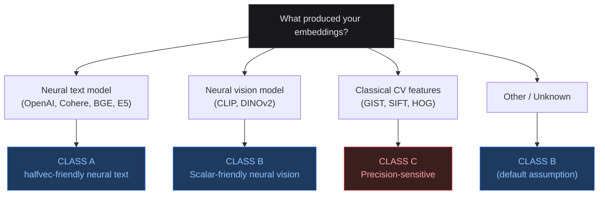
```mermaid
flowchart TD
    Start["What produced your embeddings?"] --> NT["Neural text model\n(OpenAI, Cohere, BGE, E5)"]
    Start --> NV["Neural vision model\n(CLIP, DINOv2)"]
    Start --> CV["Classical CV features\n(GIST, SIFT, HOG)"]
    Start --> Other["Other / Unknown"]

    NT --> ClassA["CLASS A\nhalfvec-friendly neural text"]
    NV --> ClassB["CLASS B\nScalar-friendly neural vision"]
    CV --> ClassC["CLASS C\nPrecision-sensitive"]
    Other --> ClassB2["CLASS B\n(default assumption)"]

    style ClassA fill:#1e3a5f,stroke:#3b82f6,color:#93c5fd
    style ClassB fill:#1e3a5f,stroke:#3b82f6,color:#93c5fd
    style ClassB2 fill:#1e3a5f,stroke:#3b82f6,color:#93c5fd
    style ClassC fill:#3b1f1f,stroke:#ef4444,color:#fca5a5
    style Start fill:#18181b,stroke:#3f3f46,color:#e4e4e7
```

**Embedding class details:**

| Class | Type | Distance Metric | pgvector Operator | Properties |
|-------|------|-----------------|-------------------|------------|
| **A** | Neural text (any dims) | Cosine | `<=>` | Centered near zero, well-distributed. `halfvec` (float16) viable at all recall targets. Neural text embeddings tolerate half-precision well. _Some models (e.g., OpenAI text-embedding-3-large) support Matryoshka dimension reduction — test truncation against recall target._ |
| **B** | Neural vision, or unknown | Cosine | `<=>` | `halfvec` viable for relaxed/moderate recall. Test carefully — some vision models are sensitive to float16 truncation. For vision models, verify distance metric with model docs. Use `<#>` if model was trained with dot-product objective. |
| **C** | Classical CV features (GIST, SIFT, HOG) | Euclidean (L2) | `<->` | Non-negative, magnitude-heavy, not centered at zero. Full `vector` (float32) often required for high recall. Using Cosine on non-normalized features gives wrong results. pgvector also supports L1/Manhattan (`<+>`). |

> **pgvector compression options:**
>
> | Method | Compression | Index dims limit | How it works |
> |---|---|---|---|
> | `halfvec` (float16) | 2x | 4,000 | Store or cast to `halfvec` — 2 bytes/dim. Expression index: `(embedding::halfvec(N))` |
> | `binary_quantize` | 32x | 64,000 | Expression index: `(binary_quantize(embedding)::bit(N))` with `bit_hamming_ops`. Re-rank with original vectors for accuracy. |
> | `subvector` | variable | 2,000 per subvec | Index a prefix: `(subvector(embedding, 1, N)::vector(N))`. For Matryoshka models that support truncation. |
>
> Binary quantization is especially powerful for high-dimensional neural text embeddings
> (Class A) where the 32x index compression dramatically reduces memory requirements.
> The re-ranking pattern (search quantized index for top-N candidates, then re-rank by
> original vectors for top-K) is a standard two-phase retrieval pattern:
>
> ```sql
> -- Binary quantized index (32x smaller than float32)
> CREATE INDEX ON items USING hnsw ((binary_quantize(embedding)::bit(1536)) bit_hamming_ops);
>
> -- Search: coarse filter on quantized, re-rank on original
> SELECT * FROM (
>     SELECT * FROM items
>     ORDER BY binary_quantize(embedding)::bit(1536) <~> binary_quantize($1)
>     LIMIT 100  -- oversampling: fetch 10x candidates
> ) candidates
> ORDER BY embedding <=> $1  -- re-rank with full precision
> LIMIT 10;
> ```

**Record: your Embedding Class and your Distance Metric (pgvector operator).**

---

## Stage 2: Determine Your Recall Regime and Vector Type

This determines how hard the algorithm has to work and which vector type you can use.

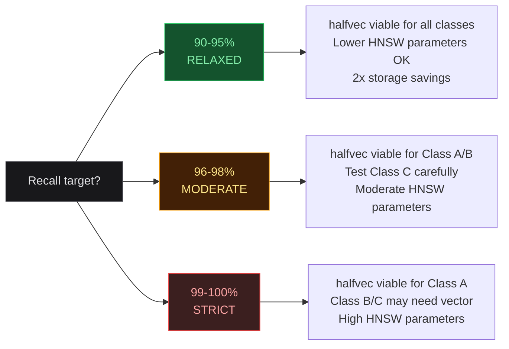
```mermaid
flowchart LR
    Start["Recall target?"] --> R["90-95%\nRELAXED"]
    Start --> M["96-98%\nMODERATE"]
    Start --> S["99-100%\nSTRICT"]

    R --> RD["halfvec viable for all classes\nLower HNSW parameters OK\n2x storage savings"]
    M --> MD["halfvec viable for Class A/B\nTest Class C carefully\nModerate HNSW parameters"]
    S --> SD["halfvec viable for Class A\nClass B/C may need vector\nHigh HNSW parameters"]

    style R fill:#14532d,stroke:#22c55e,color:#86efac
    style M fill:#422006,stroke:#f59e0b,color:#fde68a
    style S fill:#3b1f1f,stroke:#ef4444,color:#fca5a5
    style Start fill:#18181b,stroke:#3f3f46,color:#e4e4e7
```

**Boundary rule:** 95% is RELAXED. 96% is MODERATE. 99% is STRICT.

### Vector Type Feasibility Matrix

Cross-reference your Embedding Class (Stage 1) with your Recall Regime. This tells you
whether `halfvec` is viable or you need full `vector`.

| Embedding Class | RELAXED (90-95%) | MODERATE (96-98%) | STRICT (99-100%) |
|---|---|---|---|
| **CLASS A** (neural text) | `halfvec` | `halfvec` | `halfvec` |
| **CLASS B** (neural vision / unknown) | `halfvec` | `halfvec` (test recall) | `vector` (float32) |
| **CLASS C** (classical CV) | `halfvec` (test carefully) | `vector` (float32) | `vector` (float32) |

> **Expression indexing strategy:** You can store full-precision `vector` columns but
> create HNSW indexes on `::halfvec()` casts. This gives you full precision at rest
> with 2x index compression. Queries must cast to match:
>
> ```sql
> CREATE INDEX ON items USING hnsw ((embedding::halfvec(1536)) halfvec_cosine_ops);
> SELECT * FROM items ORDER BY embedding::halfvec(1536) <=> $1::halfvec(1536) LIMIT 10;
> ```

### High-Dimension Constraint: 2,000+ Dimensions

Vectors with more than 2,000 dimensions **cannot** use a direct HNSW index on a `vector`
column. You have three options depending on your dimension count:

| Dimensions | Option | Compression | Index expression |
|---|---|---|---|
| 2,001 – 4,000 | `halfvec` expression index | 2x | `(embedding::halfvec(N))` |
| 2,001 – 64,000 | Binary quantization | 32x | `(binary_quantize(embedding)::bit(N))` |
| Any | Subvector indexing | variable | `(subvector(embedding, 1, K)::vector(K))` |

**halfvec expression index** (recommended for 2,001–4,000 dims):

```sql
-- Table stores float32 (no dimension limit on storage)
CREATE TABLE items (
    id bigserial PRIMARY KEY,
    embedding vector(3072)
);

-- Index uses halfvec cast (limit is 4,000 for halfvec HNSW)
CREATE INDEX ON items USING hnsw ((embedding::halfvec(3072)) halfvec_cosine_ops);

-- Queries must cast to match the index
SELECT * FROM items ORDER BY embedding::halfvec(3072) <=> $1::halfvec(3072) LIMIT 10;
```

**Binary quantization** (for maximum compression or >4,000 dims):

```sql
-- Index uses binary quantization (limit is 64,000 for bit HNSW)
CREATE INDEX ON items USING hnsw ((binary_quantize(embedding)::bit(3072)) bit_hamming_ops);

-- Search with re-ranking for accuracy
SELECT * FROM (
    SELECT * FROM items
    ORDER BY binary_quantize(embedding)::bit(3072) <~> binary_quantize($1)
    LIMIT 100  -- coarse candidates
) candidates
ORDER BY embedding <=> $1  -- re-rank with full precision
LIMIT 10;
```

Additionally, 3072-dimension `vector` rows are ~12 KB — exceeding PostgreSQL's 8 KB page
size. You MUST set STORAGE EXTERNAL to avoid TOAST compression overhead:

```sql
ALTER TABLE items ALTER COLUMN embedding SET STORAGE EXTERNAL;
```

For vectors that fit within an 8 KB page, use STORAGE PLAIN instead:

```sql
ALTER TABLE items ALTER COLUMN embedding SET STORAGE PLAIN;
```

TOAST (The Oversized-Attribute Storage Technique) adds indirection for large values.
PLAIN keeps vectors inline in the heap page (avoiding extra I/O per row) but only works
when the row fits in a page. EXTERNAL stores out-of-line without compression — required
for oversized rows, and still avoids the CPU cost of TOAST compression.

**Record: your vector type (`halfvec` or `vector`), whether you need an expression index, and your STORAGE setting.**

---

## Stage 3: Choose Your Index Type

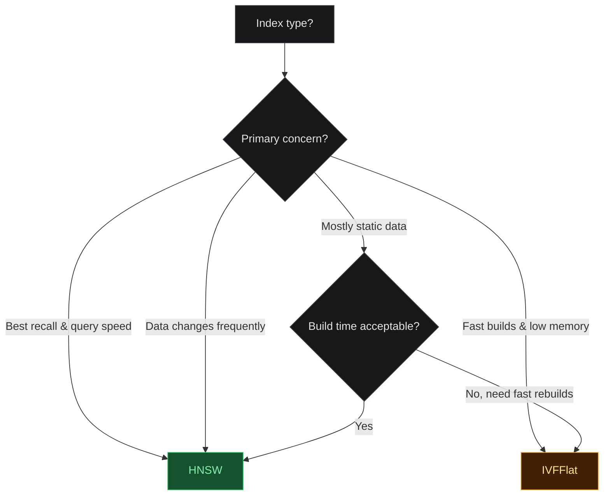
```mermaid
flowchart TD
    A["Index type?"] --> B{"Primary concern?"}
    B -->|"Best recall & query speed"| C["HNSW"]
    B -->|"Fast builds & low memory"| D["IVFFlat"]
    B -->|"Data changes frequently"| C
    B -->|"Mostly static data"| E{"Build time acceptable?"}
    E -->|"Yes"| C
    E -->|"No, need fast rebuilds"| D

    style C fill:#14532d,stroke:#22c55e,color:#86efac
    style D fill:#422006,stroke:#f59e0b,color:#fde68a
    style A fill:#18181b,stroke:#3f3f46,color:#e4e4e7
    style B fill:#18181b,stroke:#3f3f46,color:#e4e4e7
    style E fill:#18181b,stroke:#3f3f46,color:#e4e4e7
```

### HNSW vs IVFFlat

| Property | HNSW | IVFFlat |
|---|---|---|
| Recall at same speed | Higher | Lower |
| Build time | Slower (graph construction) | Faster (k-means + sort) |
| Build memory | Higher | Lower |
| Insert performance | Moderate (graph updates) | Poor (must rebuild for new data) |
| Query performance | Excellent | Good |
| Data drift tolerance | Good (no retraining) | Poor (centroids go stale) |
| Max dimensions (direct) | 2,000 | 2,000 |
| Max dimensions (halfvec) | 4,000 | 4,000 |

**Rule of thumb**: Use HNSW unless build time or memory is a hard constraint. IVFFlat
is best for large, mostly-static datasets where you can rebuild periodically.

The remainder of this guide focuses on HNSW. If you chose IVFFlat, see the
[IVFFlat Parameters appendix](#appendix-ivfflat-parameters) at the end.

**Record: your index type.**

---

## Stage 4: Set HNSW Parameters

You need these values before you can size memory or compute, so set them now.

**pgvector parameter mapping:**
- `m` and `ef_construction` are set at index creation via `WITH (m = ..., ef_construction = ...)`
- Search-time ef is called **`hnsw.ef_search`** and is set per-session via `SET hnsw.ef_search = ...`
- pgvector defaults: m=16, ef_construction=64

### Step 4a: Choose m

**pgvector parameter:** `m` in `WITH (m = ...)` at index creation — **Default:** 16

| RECALL REGIME | m | RULE |
|---|---|---|
| RELAXED | 16 | Fixed. Default is fine. |
| MODERATE | 24 | Fixed. |
| STRICT | 32 | Fixed. |

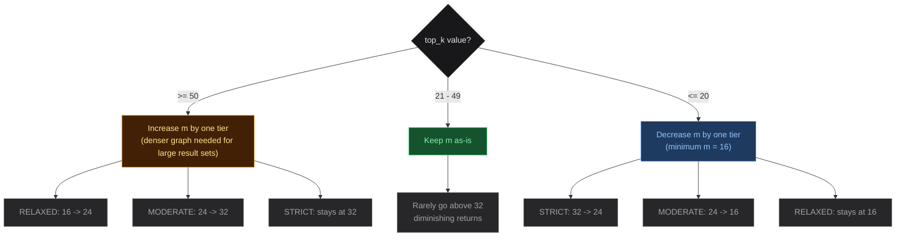
```mermaid
flowchart TD
    Start{"top_k value?"} -->|">= 50"| High["Increase m by one tier\n(denser graph needed for large result sets)"]
    Start -->|"21 - 49"| Mid["Keep m as-is"]
    Start -->|"<= 20"| Low["Decrease m by one tier\n(minimum m = 16)"]

    High --> H_R["RELAXED: 16 -> 24"]
    High --> H_M["MODERATE: 24 -> 32"]
    High --> H_S["STRICT: stays at 32"]

    Low --> L_S["STRICT: 32 -> 24"]
    Low --> L_M["MODERATE: 24 -> 16"]
    Low --> L_R["RELAXED: stays at 16"]

    Mid --> Note["Rarely go above 32\ndiminishing returns"]

    style Start fill:#18181b,stroke:#3f3f46,color:#e4e4e7
    style High fill:#422006,stroke:#f59e0b,color:#fde68a
    style Mid fill:#14532d,stroke:#22c55e,color:#86efac
    style Low fill:#1e3a5f,stroke:#3b82f6,color:#93c5fd
    style H_R fill:#27272a,stroke:#3f3f46,color:#a1a1aa
    style H_M fill:#27272a,stroke:#3f3f46,color:#a1a1aa
    style H_S fill:#27272a,stroke:#3f3f46,color:#a1a1aa
    style L_S fill:#27272a,stroke:#3f3f46,color:#a1a1aa
    style L_M fill:#27272a,stroke:#3f3f46,color:#a1a1aa
    style L_R fill:#27272a,stroke:#3f3f46,color:#a1a1aa
    style Note fill:#27272a,stroke:#3f3f46,color:#a1a1aa
```

### Step 4b: Choose ef_construction

**pgvector parameter:** `ef_construction` in `WITH (ef_construction = ...)` at index creation — **Default:** 64

ef_construction only affects index build time, not query time or RAM.
You pay this cost once.

| RECALL REGIME | ef_construction | RULE |
|---|---|---|
| RELAXED | 64 | pgvector default is sufficient. |
| MODERATE | 128 | Fixed. |
| STRICT | 256 | Fixed. Go to 512 only if benchmarks show recall is still below target after tuning ef_search. |

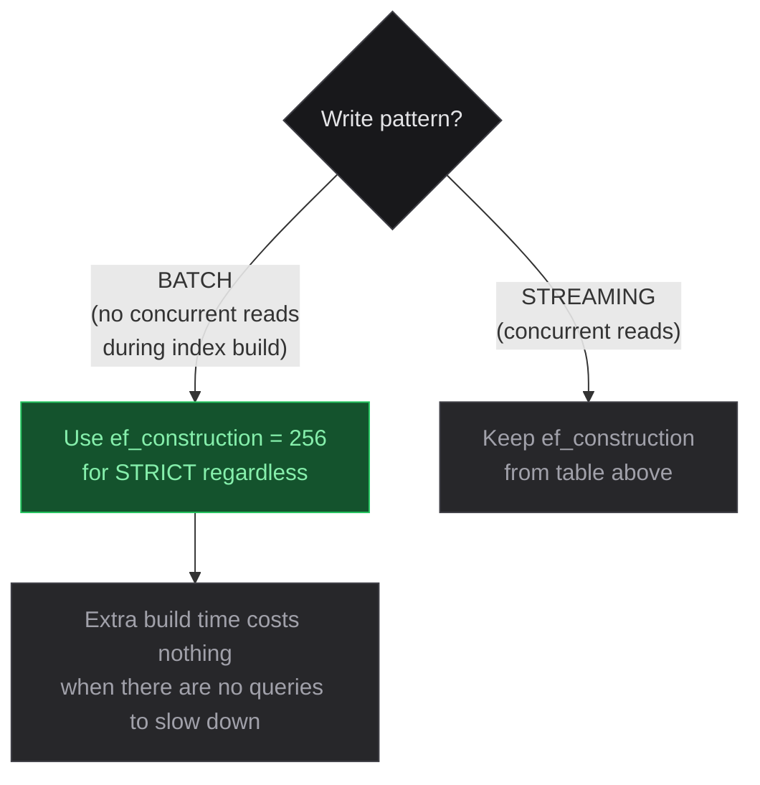
```mermaid
flowchart TD
    Q{"Write pattern?"} -->|"BATCH\n(no concurrent reads\nduring index build)"| Use256["Use ef_construction = 256\nfor STRICT regardless"]
    Q -->|"STREAMING\n(concurrent reads)"| Keep["Keep ef_construction\nfrom table above"]

    Use256 --> Note["Extra build time costs nothing\nwhen there are no queries to slow down"]

    style Q fill:#18181b,stroke:#3f3f46,color:#e4e4e7
    style Use256 fill:#14532d,stroke:#22c55e,color:#86efac
    style Keep fill:#27272a,stroke:#3f3f46,color:#a1a1aa
    style Note fill:#27272a,stroke:#3f3f46,color:#a1a1aa
```

### Step 4c: Choose hnsw.ef_search (search-time) — PRELIMINARY

Set a starting value now for compute estimation. You will refine this during benchmarking.

**pgvector parameter:** `hnsw.ef_search` (set per-session or per-transaction, not at index creation)

```sql
-- Per-session (persists for the connection lifetime)
SET hnsw.ef_search = 200;

-- Per-transaction (scoped, auto-resets)
BEGIN;
SET LOCAL hnsw.ef_search = 200;
SELECT * FROM items ORDER BY embedding <=> $1 LIMIT 10;
COMMIT;
```

> **IMPORTANT: Supabase connection pooling note.** Supavisor in **transaction mode**
> (the default on port 6543) resets session state between transactions. `SET hnsw.ef_search`
> will be lost. You must either:
> - Use `SET LOCAL` inside every transaction, or
> - Connect via **session mode** (port 5432) to preserve session-level SETs, or
> - Connect directly to the database (bypassing Supavisor)

hnsw.ef_search must be >= top_k (hard constraint).

| RECALL REGIME | STARTING ef_search | RULE |
|---|---|---|
| RELAXED | max(2x top_k, 40) | Fixed multiplier with floor. |
| MODERATE | max(4x top_k, 100) | Fixed multiplier with floor. |
| STRICT | max(8x top_k, 200) | Fixed multiplier with floor. |

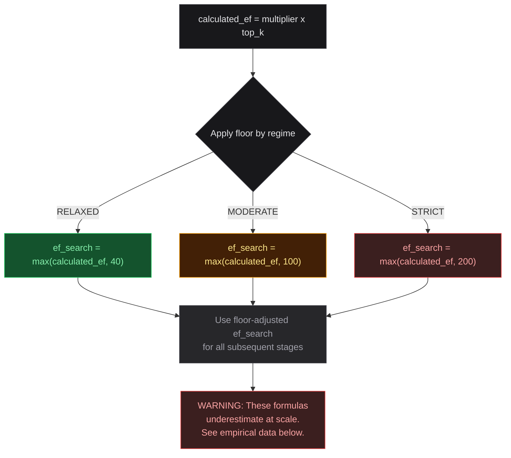
```mermaid
flowchart TD
    Calc["calculated_ef = multiplier x top_k"] --> Floor{"Apply floor by regime"}

    Floor -->|"RELAXED"| FR["ef_search = max(calculated_ef, 40)"]
    Floor -->|"MODERATE"| FM["ef_search = max(calculated_ef, 100)"]
    Floor -->|"STRICT"| FS["ef_search = max(calculated_ef, 200)"]

    FR --> Use["Use floor-adjusted ef_search\nfor all subsequent stages"]
    FM --> Use
    FS --> Use

    Use --> Warn["WARNING: These formulas\nunderestimate at scale.\nSee empirical data below."]

    style Calc fill:#18181b,stroke:#3f3f46,color:#e4e4e7
    style Floor fill:#18181b,stroke:#3f3f46,color:#e4e4e7
    style FR fill:#14532d,stroke:#22c55e,color:#86efac
    style FM fill:#422006,stroke:#f59e0b,color:#fde68a
    style FS fill:#3b1f1f,stroke:#ef4444,color:#fca5a5
    style Use fill:#27272a,stroke:#3f3f46,color:#a1a1aa
    style Warn fill:#3b1f1f,stroke:#ef4444,color:#fca5a5
```

**CRITICAL: These formulas underestimate at scale.** At 1M vectors, empirical testing
on Supabase shows that STRICT recall targets need significantly higher ef_search than
the formula suggests:

| Dataset | Vectors | top_k | Formula result | Actual ef_search needed | Recall achieved |
|---|---|---|---|---|---|
| gist-960 (99% target) | 1,000,000 | 10 | max(80, 200) = 200 | **400** | 99.6% |
| dbpedia-3072 (95% target) | 1,000,000 | 100 | max(200, 40) = 200 | 200 | 98.3% |

The formula works well for RELAXED targets but consistently underestimates for STRICT
(>98%) recall at 1M+ vectors. **Always validate ef_search empirically** against your
recall target at production scale. Higher ef_search increases latency proportionally
(~2x ef_search = ~2x query time) but recall improvements are nonlinear — the last
few percentage points are expensive.

### Step 4d: Parallel Index Build

Speed up HNSW builds with parallel workers. On Supabase, these settings are
configurable via SQL:

```sql
-- Set memory for index build (configurable on Supabase via SQL)
SET maintenance_work_mem = '8GB';

-- Set parallel workers (configurable on Supabase via SQL)
SET max_parallel_maintenance_workers = 7;  -- plus leader = 8 total

-- Build the index (use CONCURRENTLY to avoid blocking writes)
CREATE INDEX CONCURRENTLY ON items
    USING hnsw ((embedding::halfvec(3072)) halfvec_cosine_ops)
    WITH (m = 16, ef_construction = 128);
```

**Benchmark reference (Supabase 4XL, 16 vCPU, 4 parallel workers):**

| Dataset | Dimensions | Vector Type | m | ef_construction | Build Time |
|---|---|---|---|---|---|
| dbpedia | 3072 (halfvec expression) | halfvec | 16 | 128 | ~50 min |
| gist-960 | 960 | vector | 24 | 256 | ~35 min |

**Record: your m, ef_construction, preliminary ef_search, and parallel worker count.**

---

## Stage 5: Assess Your Latency Budget

This determines what must fit in shared_buffers for acceptable performance.

In pgvector, the critical performance boundary is **whether the HNSW index fits entirely
in shared_buffers**. PostgreSQL manages caching through its shared buffer pool. If the
index doesn't fit, every query incurs disk I/O and latency degrades catastrophically.

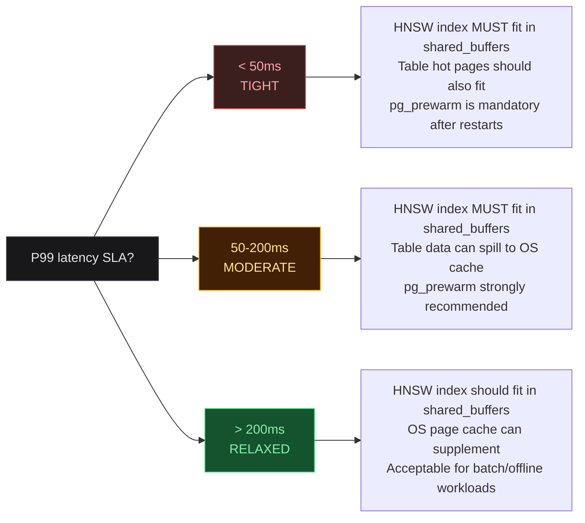
```mermaid
flowchart LR
    Start["P99 latency SLA?"] --> T["< 50ms\nTIGHT"]
    Start --> MO["50-200ms\nMODERATE"]
    Start --> RE["> 200ms\nRELAXED"]

    T --> TD["HNSW index MUST fit in shared_buffers\nTable hot pages should also fit\npg_prewarm is mandatory after restarts"]
    MO --> MOD["HNSW index MUST fit in shared_buffers\nTable data can spill to OS cache\npg_prewarm strongly recommended"]
    RE --> RED["HNSW index should fit in shared_buffers\nOS page cache can supplement\nAcceptable for batch/offline workloads"]

    style T fill:#3b1f1f,stroke:#ef4444,color:#fca5a5
    style MO fill:#422006,stroke:#f59e0b,color:#fde68a
    style RE fill:#14532d,stroke:#22c55e,color:#86efac
    style Start fill:#18181b,stroke:#3f3f46,color:#e4e4e7
```

### The shared_buffers Rule for Vector Workloads

> **shared_buffers >= HNSW index size.** The standard PostgreSQL guidance of 25% of RAM
> is **WRONG for vector workloads**.

When the HNSW index doesn't fit in shared_buffers, every query traverses the graph via
disk I/O. This causes **40-60x latency degradation**:

| Cache State | EXPLAIN ANALYZE Buffers | Query Latency (1M vectors, gist-960) |
|---|---|---|
| **Warm** (index in shared_buffers) | `shared hit=4839, read=0` | **21 ms** |
| **Cold** (index on disk) | `shared hit=3261, read=1578` | **834 ms** |

The `read=1578` in the cold case means 1,578 buffer pages were fetched from disk during
a single query. Each disk read adds ~0.5ms of latency. This is the single most important
performance factor in pgvector.

```sql
-- Verify cache behavior with EXPLAIN (ANALYZE, BUFFERS):
EXPLAIN (ANALYZE, BUFFERS)
SELECT id FROM items ORDER BY embedding::halfvec(3072) <=> $1::halfvec(3072) LIMIT 10;

-- Look for "shared read=0" — any reads mean cache misses
-- shared hit = pages served from shared_buffers (fast)
-- read = pages fetched from disk (slow)
```

### Cache Warming with pg_prewarm

After any database restart, the HNSW index is cold (on disk). **pg_prewarm is essential
for production deployments.** Without it, the first queries after a restart see 40-60x
higher latency until the index naturally warms through query activity.

```sql
-- Warm the HNSW index into shared_buffers
SELECT pg_prewarm('items_embedding_idx');

-- Verify it's in cache
SELECT
    pg_size_pretty(pg_relation_size('items_embedding_idx')) AS index_size;

-- Check cache hit ratio after warming
EXPLAIN (ANALYZE, BUFFERS)
SELECT id FROM items ORDER BY embedding <=> $1 LIMIT 10;
-- Confirm: shared read=0
```

> **Supabase note:** pg_prewarm is available on Supabase. After any compute tier change
> or planned restart, run pg_prewarm on all HNSW indexes before routing production traffic.
> Consider adding pg_prewarm calls to your application's startup/health-check routine.

**Record: your latency tier and whether pg_prewarm is required.**

---

## Stage 6: Size Your Memory

### Step 6a: Table Size

```
table_bytes = num_vectors * (dimensions * bytes_per_dim + tuple_overhead)
```

Where:
- `bytes_per_dim`: 4 for `vector`, 2 for `halfvec`
- `tuple_overhead`: ~36 bytes (heap tuple header + alignment + ItemPointer)

### Step 6b: HNSW Index Size

```
index_bytes = num_vectors * (2 * m * 8 + dimensions * index_bytes_per_dim) * 1.2
```

The index stores a copy of each vector plus the graph structure (~2 * m neighbor
pointers at 8 bytes each). The 1.2 multiplier accounts for internal page overhead
and free space.

**Important:** The index uses the vector type from the index definition, not the
table column. If you use a halfvec expression index, `index_bytes_per_dim` = 2,
even if the table stores float32.

**Common values (per 1M vectors):**

| Dimensions | Vector Type (in index) | m | Table Size | Index Size | Notes |
|---|---|---|---|---|---|
| 768 | vector (float32) | 16 | ~3.2 GB | ~4.8 GB | Standard text embeddings |
| 1536 | vector (float32) | 16 | ~6.1 GB | ~8.6 GB | OpenAI ada-002 |
| 1536 | halfvec (float16) | 16 | ~3.1 GB | ~4.5 GB | Expression index on float32 column |
| 3072 | halfvec (float16) | 16 | ~12 GB | ~8.7 GB | OpenAI text-embedding-3-large, expression index |
| 960 | vector (float32) | 24 | ~4.0 GB | ~7.7 GB | GIST-960 benchmark |

### Step 6c: shared_buffers Sizing

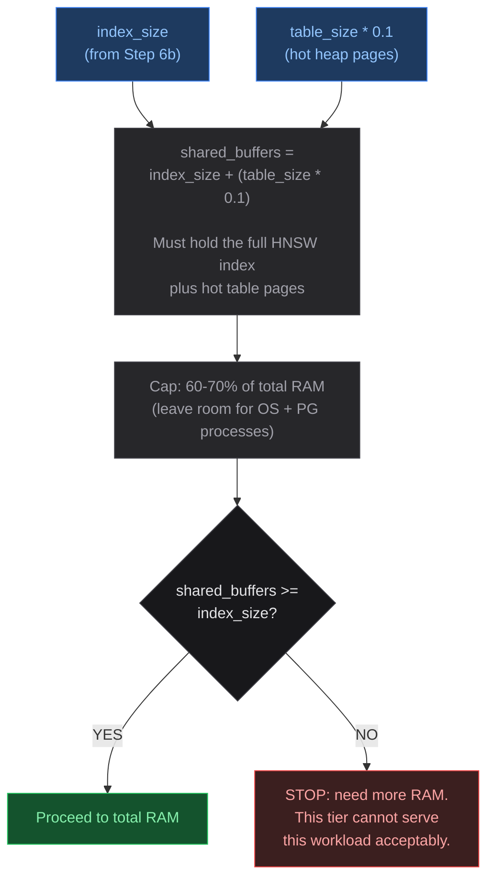
```mermaid
flowchart TD
    IX["index_size\n(from Step 6b)"] --> SB["shared_buffers =\nindex_size + (table_size * 0.1)\n\nMust hold the full HNSW index\nplus hot table pages"]
    TS["table_size * 0.1\n(hot heap pages)"] --> SB

    SB --> Cap["Cap: 60-70% of total RAM\n(leave room for OS + PG processes)"]
    Cap --> Check{"shared_buffers >=\nindex_size?"}
    Check -->|"YES"| OK["Proceed to total RAM"]
    Check -->|"NO"| Fail["STOP: need more RAM.\nThis tier cannot serve\nthis workload acceptably."]

    style IX fill:#1e3a5f,stroke:#3b82f6,color:#93c5fd
    style TS fill:#1e3a5f,stroke:#3b82f6,color:#93c5fd
    style SB fill:#27272a,stroke:#3f3f46,color:#a1a1aa
    style Cap fill:#27272a,stroke:#3f3f46,color:#a1a1aa
    style Check fill:#18181b,stroke:#3f3f46,color:#e4e4e7
    style OK fill:#14532d,stroke:#22c55e,color:#86efac
    style Fail fill:#3b1f1f,stroke:#ef4444,color:#fca5a5
```

### Step 6d: effective_cache_size

Tells the query planner how much total memory is available for caching (shared_buffers
+ OS page cache). Does not allocate memory — purely advisory.

**Rule of thumb**: 75% of total RAM.

### Step 6e: Total RAM Requirement

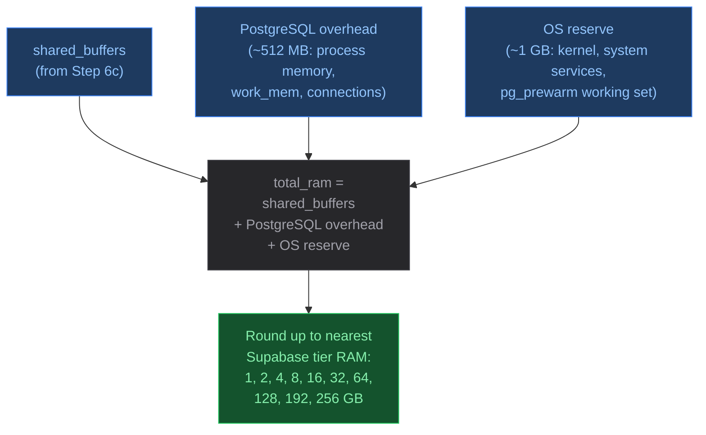
```mermaid
flowchart TD
    SB["shared_buffers\n(from Step 6c)"] --> Sum["total_ram =\nshared_buffers\n+ PostgreSQL overhead\n+ OS reserve"]
    PO["PostgreSQL overhead\n(~512 MB: process memory,\nwork_mem, connections)"] --> Sum
    OS["OS reserve\n(~1 GB: kernel, system services,\npg_prewarm working set)"] --> Sum

    Sum --> Round["Round up to nearest\nSupabase tier RAM:\n1, 2, 4, 8, 16, 32, 64,\n128, 192, 256 GB"]

    style SB fill:#1e3a5f,stroke:#3b82f6,color:#93c5fd
    style PO fill:#1e3a5f,stroke:#3b82f6,color:#93c5fd
    style OS fill:#1e3a5f,stroke:#3b82f6,color:#93c5fd
    style Sum fill:#27272a,stroke:#3f3f46,color:#a1a1aa
    style Round fill:#14532d,stroke:#22c55e,color:#86efac
```

**Worked example (1M vectors, 3072d, halfvec expression index, m=16):**

| Component | Size |
|---|---|
| Table (vector float32, 3072d) | ~12 GB |
| HNSW index (halfvec, 3072d, m=16) | ~8.7 GB |
| shared_buffers needed | >= 8.7 + 1.2 = ~10 GB |
| PostgreSQL overhead | ~512 MB |
| OS reserve | ~1 GB |
| **Total RAM needed** | **~12 GB minimum** |
| **Recommended RAM** | **32-64 GB** (room for both scenarios + headroom) |

**Record: your table size, index size, shared_buffers target, and total RAM requirement.**

---

## Stage 7: Size Your Disk

Everything persists to disk regardless of whether it's cached in shared_buffers.
PostgreSQL uses disk as the durable backing store.

### Step 7a: Base Disk

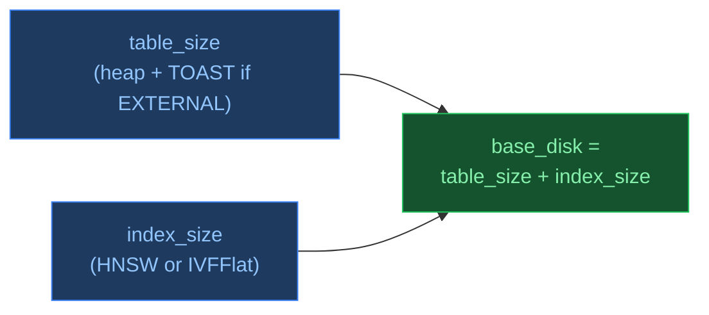
```mermaid
flowchart LR
    TS["table_size\n(heap + TOAST if EXTERNAL)"] --> Sum["base_disk =\ntable_size + index_size"]
    IX["index_size\n(HNSW or IVFFlat)"] --> Sum

    style TS fill:#1e3a5f,stroke:#3b82f6,color:#93c5fd
    style IX fill:#1e3a5f,stroke:#3b82f6,color:#93c5fd
    style Sum fill:#14532d,stroke:#22c55e,color:#86efac
```

### Step 7b: WAL (Write-Ahead Log) Space

PostgreSQL uses WAL for crash recovery and replication. WAL accumulates writes
before they're checkpointed to data files.

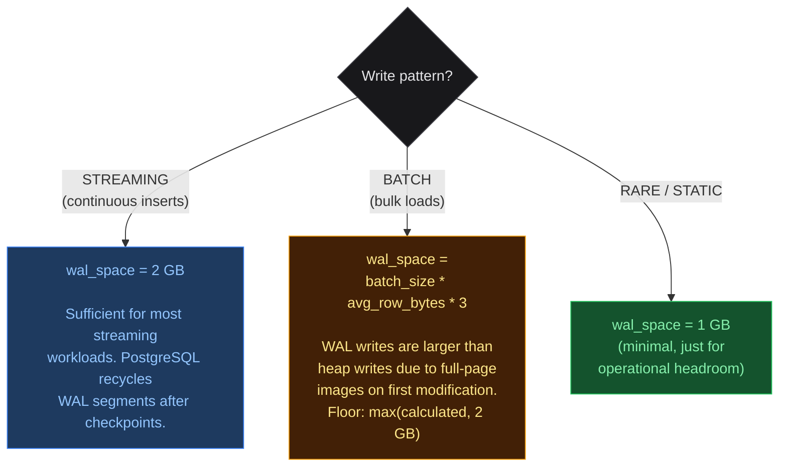
```mermaid
flowchart TD
    Start{"Write pattern?"} -->|"STREAMING\n(continuous inserts)"| Stream["wal_space = 2 GB\n\nSufficient for most streaming\nworkloads. PostgreSQL recycles\nWAL segments after checkpoints."]
    Start -->|"BATCH\n(bulk loads)"| Batch["wal_space =\nbatch_size * avg_row_bytes * 3\n\nWAL writes are larger than\nheap writes due to full-page\nimages on first modification.\nFloor: max(calculated, 2 GB)"]
    Start -->|"RARE / STATIC"| Static["wal_space = 1 GB\n(minimal, just for\noperational headroom)"]

    style Start fill:#18181b,stroke:#3f3f46,color:#e4e4e7
    style Stream fill:#1e3a5f,stroke:#3b82f6,color:#93c5fd
    style Batch fill:#422006,stroke:#f59e0b,color:#fde68a
    style Static fill:#14532d,stroke:#22c55e,color:#86efac
```

### Step 7c: Operational Headroom

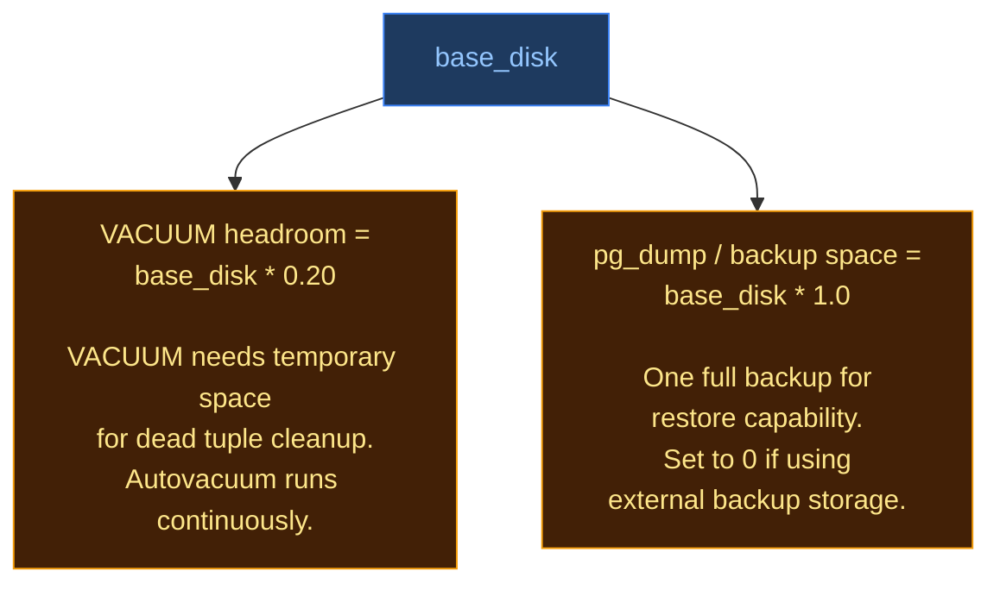
```mermaid
flowchart TD
    BD["base_disk"] --> Vacuum["VACUUM headroom =\nbase_disk * 0.20\n\nVACUUM needs temporary space\nfor dead tuple cleanup.\nAutovacuum runs continuously."]
    BD --> Backup["pg_dump / backup space =\nbase_disk * 1.0\n\nOne full backup for\nrestore capability.\nSet to 0 if using\nexternal backup storage."]

    style BD fill:#1e3a5f,stroke:#3b82f6,color:#93c5fd
    style Vacuum fill:#422006,stroke:#f59e0b,color:#fde68a
    style Backup fill:#422006,stroke:#f59e0b,color:#fde68a
```

### Step 7d: Total Disk

```
total_disk = base_disk + wal_space + vacuum_headroom + backup_space
```

Minimum 8 GB (Supabase base allocation).

> **Supabase disk auto-scaling:** Supabase automatically scales disk when usage exceeds
> 90% of the current allocation. However, during a disk resize the database enters
> **read-only mode** temporarily. Plan your initial disk allocation to avoid unexpected
> read-only events during write-heavy operations (bulk loads, index builds).

**Record: your total disk requirement.**

---

## Stage 8: Size Your Compute (vCPUs)

### Step 8a: Estimate Per-Query CPU Time

Per-query time depends on ef_search and the cost of each distance computation
(driven by dimensions and vector type).

**Measured server-side query times (EXPLAIN ANALYZE, 1M vectors, warm cache, Supabase 4XL):**

| ef_search | gist-960 (960d, vector) | dbpedia (3072d, halfvec) |
|---|---|---|
| 40 | 18 ms (1.0x) | 34 ms (1.0x) |
| 80 | 15 ms (0.8x) | 27 ms (0.8x) |
| 128 | 17 ms (1.0x) | 45 ms (1.3x) |
| 200 | 24 ms (1.4x) | 67 ms (2.0x) |
| 400 | 65 ms (3.7x) | 293 ms (8.7x) |
| 800 | 115 ms (6.5x) | 646 ms (19.2x) |

**Key observations:**
- The relationship between ef_search and latency is **superlinear**, not linear — especially for high-dimensional vectors. Doubling ef_search from 200→400 increases latency 4x for 3072d.
- Higher dimensions amplify the ef_search cost: 960d scales ~6.5x at ef=800 while 3072d scales ~19x.
- For compute sizing estimates, use the measured values above rather than a linear formula. Interpolate for other dimension/ef combinations.

**Rough estimation formula** (conservative, for dimensions and ef_search not in the table):

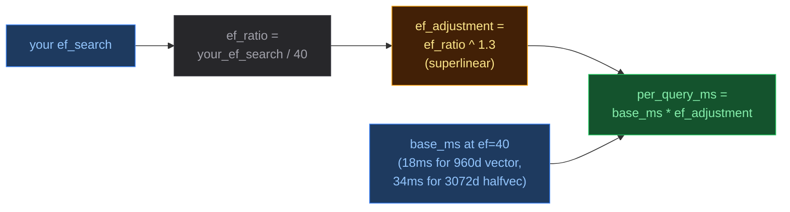
```mermaid
flowchart LR
    EF["your ef_search"] --> Div["ef_ratio =\nyour_ef_search / 40"] --> Pow["ef_adjustment =\nef_ratio ^ 1.3\n(superlinear)"] --> Mul["per_query_ms =\nbase_ms * ef_adjustment"]
    TV["base_ms at ef=40\n(18ms for 960d vector,\n34ms for 3072d halfvec)"] --> Mul

    style EF fill:#1e3a5f,stroke:#3b82f6,color:#93c5fd
    style TV fill:#1e3a5f,stroke:#3b82f6,color:#93c5fd
    style Pow fill:#422006,stroke:#f59e0b,color:#fde68a
    style Div fill:#27272a,stroke:#3f3f46,color:#a1a1aa
    style Mul fill:#14532d,stroke:#22c55e,color:#86efac
```

> **Use the measured table above for production sizing.** The formula is a fallback for dimensions/ef values not covered by the measurements.

> **pgvector quantization and rescoring:** For `halfvec` and direct `vector` indexes,
> the distance computation uses the stored vector directly — no separate rescoring step.
> However, **binary quantization** (`binary_quantize()`) does support a two-phase
> search pattern: coarse search on the quantized index, then re-rank candidates using
> original full-precision vectors. This can dramatically reduce index memory for
> high-dimensional embeddings.

### Step 8b: Calculate Required Cores for QPS

> **cores_for_queries** = `target_QPS` x `per_query_time_seconds`

Add headroom for PostgreSQL background processes:

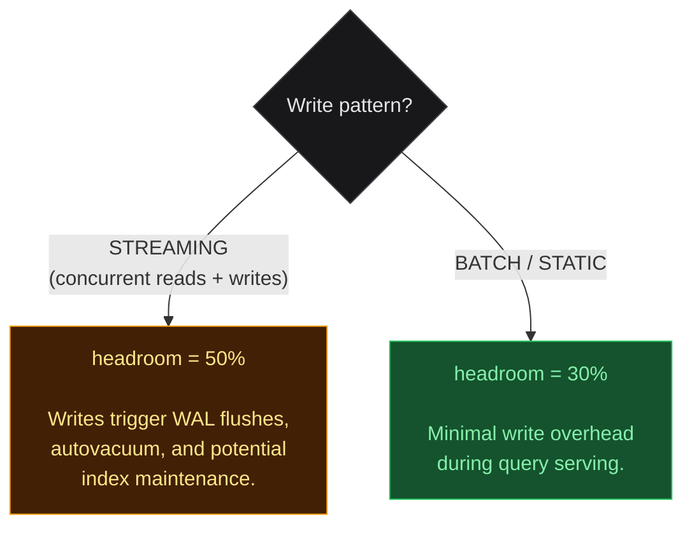
```mermaid
flowchart TD
    Q{"Write pattern?"} -->|"STREAMING\n(concurrent reads + writes)"| Stream["headroom = 50%\n\nWrites trigger WAL flushes,\nautovacuum, and potential\nindex maintenance."]
    Q -->|"BATCH / STATIC"| Batch["headroom = 30%\n\nMinimal write overhead\nduring query serving."]

    style Q fill:#18181b,stroke:#3f3f46,color:#e4e4e7
    style Stream fill:#422006,stroke:#f59e0b,color:#fde68a
    style Batch fill:#14532d,stroke:#22c55e,color:#86efac
```

### Step 8c: Account for Background Processes

PostgreSQL runs several background processes that consume CPU:

| Process | CPU Impact | Notes |
|---|---|---|
| autovacuum workers | 1-2 vCPUs during active vacuum | Configurable frequency |
| WAL writer | Minimal | Continuous but lightweight |
| checkpointer | Periodic spikes | Every checkpoint_timeout |
| stats collector | Minimal | Continuous |
| bgwriter | Minimal | Continuous |

**Reserve 2 vCPUs** for background processes on any production workload.

### Step 8d: Total vCPUs

> **total_vcpus** = `cores_for_queries` + `headroom_cores` + `background_reserve (2)` -- round up, minimum 2 vCPUs

**Record: your total vCPU requirement.**

---

## Stage 9: Select Supabase Compute Tier

### Supabase Compute Tiers

| Tier | vCPU | RAM | Monthly Cost | CPU Type | shared_buffers (default) |
|---|---|---|---|---|---|
| Micro | 2-core ARM | 1 GB | ~$10 | Shared | 256 MB |
| Small | 2-core ARM | 2 GB | ~$15 | Shared | 512 MB |
| Medium | 2-core ARM | 4 GB | ~$60 | Shared | 1 GB |
| Large | 2-core ARM | 8 GB | ~$110 | Dedicated | 2 GB |
| XL | 4-core ARM | 16 GB | ~$210 | Dedicated | 4 GB |
| 2XL | 8-core ARM | 32 GB | ~$410 | Dedicated | 8 GB |
| 4XL | 16-core ARM | 64 GB | ~$800 | Dedicated | 20 GB |
| 8XL | 32-core ARM | 128 GB | ~$1,600 | Dedicated | ~40 GB |
| 12XL | 48-core ARM | 192 GB | ~$2,400 | Dedicated | ~60 GB |
| 16XL | 64-core ARM | 256 GB | ~$3,200 | Dedicated | ~80 GB |

**Shared CPU** (Micro-Medium): suitable for development, small datasets, and low-QPS
workloads. CPU is shared with other tenants — performance is unpredictable under load.

**Dedicated CPU** (Large+): required for production vector search workloads. Consistent
performance without noisy-neighbor effects.

### Tier Selection Logic

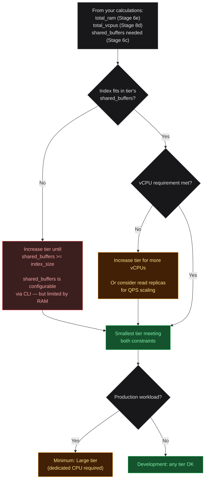
```mermaid
flowchart TD
    A["From your calculations:\ntotal_ram (Stage 6e)\ntotal_vcpus (Stage 8d)\nshared_buffers needed (Stage 6c)"] --> B{"Index fits in tier's\nshared_buffers?"}
    B -->|"No"| C["Increase tier until\nshared_buffers >= index_size\n\nshared_buffers is configurable\nvia CLI — but limited by RAM"]
    B -->|"Yes"| D{"vCPU requirement met?"}
    D -->|"No"| E["Increase tier for more vCPUs\n\nOr consider read replicas\nfor QPS scaling"]
    D -->|"Yes"| F["Smallest tier meeting\nboth constraints"]

    C --> F
    E --> F

    F --> G{"Production workload?"}
    G -->|"Yes"| H["Minimum: Large tier\n(dedicated CPU required)"]
    G -->|"No"| I["Development: any tier OK"]

    style A fill:#18181b,stroke:#3f3f46,color:#e4e4e7
    style B fill:#18181b,stroke:#3f3f46,color:#e4e4e7
    style C fill:#3b1f1f,stroke:#ef4444,color:#fca5a5
    style D fill:#18181b,stroke:#3f3f46,color:#e4e4e7
    style E fill:#422006,stroke:#f59e0b,color:#fde68a
    style F fill:#14532d,stroke:#22c55e,color:#86efac
    style G fill:#18181b,stroke:#3f3f46,color:#e4e4e7
    style H fill:#422006,stroke:#f59e0b,color:#fde68a
    style I fill:#14532d,stroke:#22c55e,color:#86efac
```

> **The shared_buffers constraint dominates.** In our benchmarks, the difference between
> an index that fits in shared_buffers and one that doesn't is 40-60x latency. Choosing
> a tier with enough RAM for shared_buffers is more important than having enough vCPUs.
> You can always scale QPS with read replicas, but you cannot work around insufficient
> shared_buffers without upgrading the tier.

**Record: your selected Supabase tier.**

---

## Stage 10: PostgreSQL Configuration

### Supabase Configuration Methods

Not all PostgreSQL settings are configurable on Supabase. Here is the complete reference:

| Setting | How to Configure on Supabase | Restart Required? |
|---|---|---|
| `shared_buffers` | Supabase CLI: `supabase postgres-config update --config shared_buffers=20GB` | **Yes** |
| `work_mem` | SQL: `ALTER SYSTEM SET work_mem = '256MB';` then `SELECT pg_reload_conf();` | No |
| `maintenance_work_mem` | SQL: `SET maintenance_work_mem = '8GB';` (session-level for builds) | No |
| `effective_cache_size` | SQL: `ALTER SYSTEM SET effective_cache_size = '48GB';` then `SELECT pg_reload_conf();` | No |
| `max_parallel_maintenance_workers` | SQL: `SET max_parallel_maintenance_workers = 7;` | No |
| `max_parallel_workers_per_gather` | SQL: `SET max_parallel_workers_per_gather = 4;` | No |
| `hnsw.ef_search` | SQL: `SET hnsw.ef_search = 200;` (always works, session-level) | No |
| `ivfflat.probes` | SQL: `SET ivfflat.probes = 10;` (always works, session-level) | No |
| `hnsw.iterative_scan` | SQL: `SET hnsw.iterative_scan = relaxed_order;` (session-level) | No |

**NOT configurable on Supabase:**

| Setting | Why |
|---|---|
| `wal_buffers` | Managed by Supabase platform |
| `checkpoint_completion_target` | Managed by Supabase platform |
| `max_connections` | Set by Supabase based on tier |
| `max_wal_size` | Managed by Supabase platform |

### Recommended Configuration by Tier

```sql
-- For a 4XL (16v/64GB) running vector workloads:

-- shared_buffers: set via CLI (requires restart)
-- supabase postgres-config update --config shared_buffers=20GB

-- Query planner hint (no memory allocation)
ALTER SYSTEM SET effective_cache_size = '48GB';

-- Per-operation sort/hash memory
ALTER SYSTEM SET work_mem = '256MB';

-- Apply changes that don't need restart
SELECT pg_reload_conf();

-- Session-level settings for index builds
SET maintenance_work_mem = '8GB';
SET max_parallel_maintenance_workers = 7;

-- Session-level search tuning
SET hnsw.ef_search = 200;
```

### Memory Configuration Rules

| Setting | Rule | Minimum |
|---|---|---|
| `shared_buffers` | >= HNSW index size, max 60-70% of RAM | 128 MB |
| `effective_cache_size` | 75% of total RAM | 1 GB |
| `work_mem` | total_ram / (4 * max_connections), min 64 MB | 64 MB |
| `maintenance_work_mem` | 1-2 GB for index builds, higher for large indexes | 512 MB |

### Parallel Worker Configuration

| Setting | Purpose | Recommendation |
|---|---|---|
| `max_parallel_workers_per_gather` | Query parallelism | total_vcpus / 4, max 4 |
| `max_parallel_maintenance_workers` | Index build parallelism | total_vcpus / 2, max 7 |

**Record: your PostgreSQL configuration settings.**

---

## Stage 11: Distance Metrics and Operators

### Core Operators

| Metric | Operator | vector Ops Class | When to Use |
|---|---|---|---|
| L2 (Euclidean) | `<->` | `vector_l2_ops` | Classical CV features, spatial data |
| Cosine | `<=>` | `vector_cosine_ops` | Neural embeddings (text, vision) — most common |
| Inner Product | `<#>` | `vector_ip_ops` | When vectors are pre-normalized; returns negative IP |
| L1 (Manhattan) | `<+>` | `vector_l1_ops` | Sparse features, robust to outliers |
| Hamming | `<~>` | `bit_hamming_ops` | Binary hashes (`bit` type only) |
| Jaccard | `<%>` | `bit_jaccard_ops` | Set similarity (`bit` type only) |

### halfvec Operators

When using `halfvec` columns or expression indexes, use the corresponding ops class:

| Metric | Operator | halfvec Ops Class |
|---|---|---|
| L2 (Euclidean) | `<->` | `halfvec_l2_ops` |
| Cosine | `<=>` | `halfvec_cosine_ops` |
| Inner Product | `<#>` | `halfvec_ip_ops` |

### sparsevec Operators

When using `sparsevec` columns:

| Metric | Operator | sparsevec Ops Class |
|---|---|---|
| L2 (Euclidean) | `<->` | `sparsevec_l2_ops` |
| Cosine | `<=>` | `sparsevec_cosine_ops` |
| Inner Product | `<#>` | `sparsevec_ip_ops` |

### Choosing the Right Metric

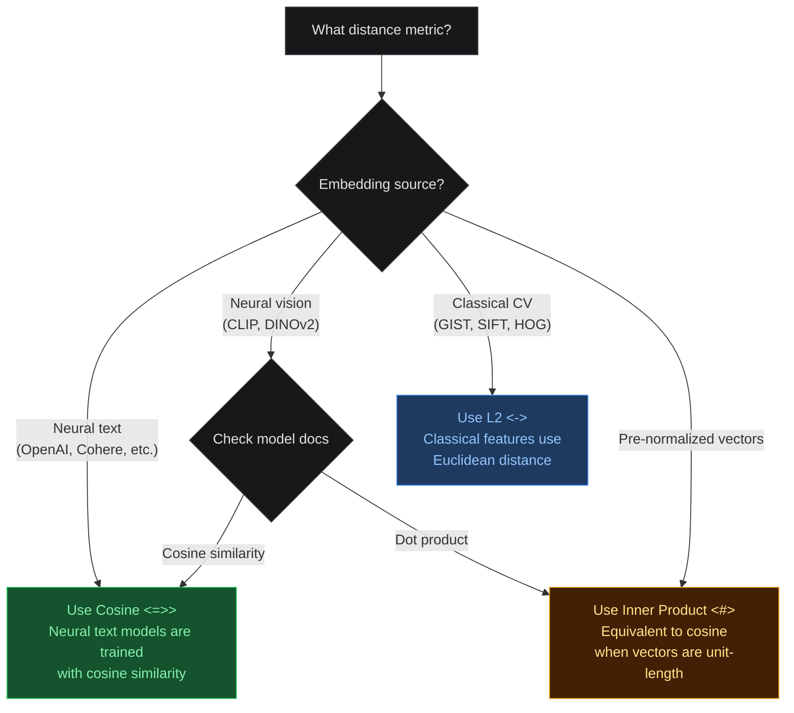
```mermaid
flowchart TD
    Start["What distance metric?"] --> Check{"Embedding source?"}
    Check -->|"Neural text\n(OpenAI, Cohere, etc.)"| Cosine["Use Cosine <=>>\nNeural text models are trained\nwith cosine similarity"]
    Check -->|"Neural vision\n(CLIP, DINOv2)"| VCheck{"Check model docs"}
    Check -->|"Classical CV\n(GIST, SIFT, HOG)"| L2["Use L2 <->\nClassical features use\nEuclidean distance"]
    Check -->|"Pre-normalized vectors"| IP["Use Inner Product <#>\nEquivalent to cosine\nwhen vectors are unit-length"]

    VCheck -->|"Cosine similarity"| Cosine
    VCheck -->|"Dot product"| IP

    style Start fill:#18181b,stroke:#3f3f46,color:#e4e4e7
    style Check fill:#18181b,stroke:#3f3f46,color:#e4e4e7
    style Cosine fill:#14532d,stroke:#22c55e,color:#86efac
    style L2 fill:#1e3a5f,stroke:#3b82f6,color:#93c5fd
    style IP fill:#422006,stroke:#f59e0b,color:#fde68a
    style VCheck fill:#18181b,stroke:#3f3f46,color:#e4e4e7
```

> **WARNING: Using the wrong distance metric silently degrades recall.** Cosine on
> non-normalized classical CV features gives wrong results. L2 on cosine-trained neural
> embeddings wastes precision on magnitude differences that carry no semantic signal.

---

## Stage 12: Scaling Strategies

### Read Replicas

For read-heavy workloads, Supabase supports read replicas:

- Each replica has its own PostgreSQL instance with independent shared_buffers
- Near-linear QPS scaling for read-only workloads
- Replicas can be in different regions for latency reduction
- HNSW indexes must be warmed independently on each replica after creation/restart

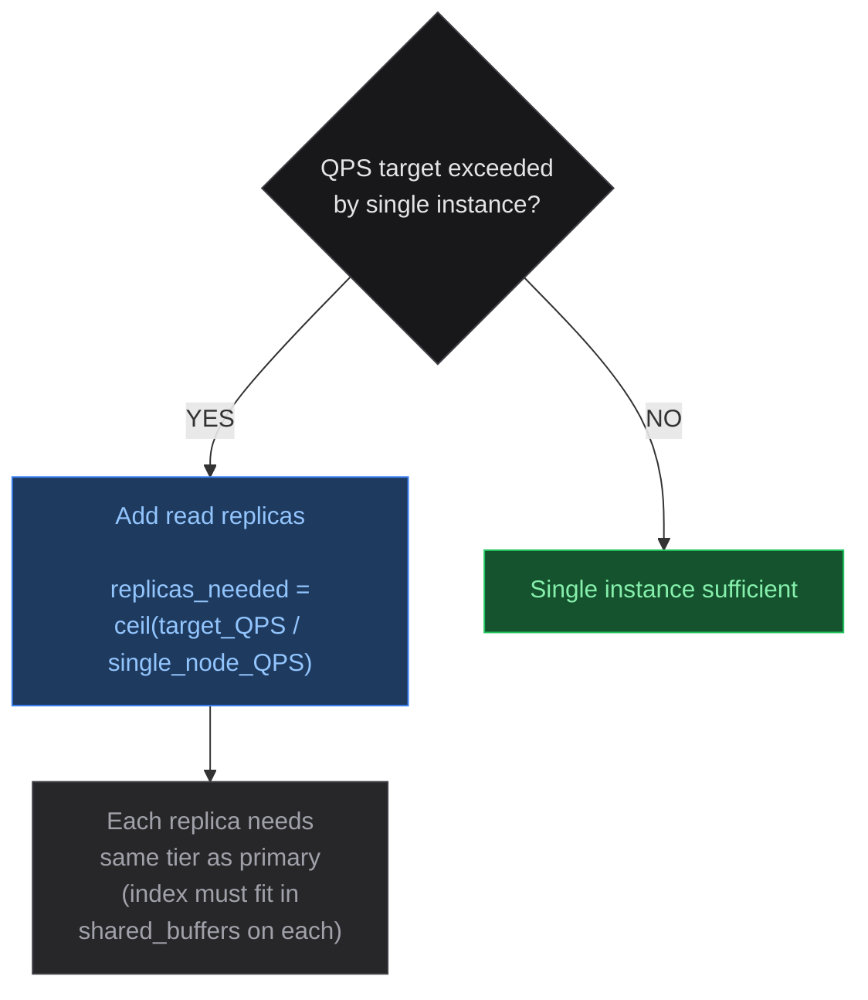
```mermaid
flowchart TD
    Q{"QPS target exceeded\nby single instance?"} -->|"YES"| Rep["Add read replicas\n\nreplicas_needed =\nceil(target_QPS / single_node_QPS)"]
    Q -->|"NO"| Single["Single instance sufficient"]

    Rep --> Note["Each replica needs\nsame tier as primary\n(index must fit in\nshared_buffers on each)"]

    style Q fill:#18181b,stroke:#3f3f46,color:#e4e4e7
    style Rep fill:#1e3a5f,stroke:#3b82f6,color:#93c5fd
    style Single fill:#14532d,stroke:#22c55e,color:#86efac
    style Note fill:#27272a,stroke:#3f3f46,color:#a1a1aa
```

### Table Partitioning

For very large datasets (>10M vectors), partition to keep individual indexes manageable:

```sql
-- Range partition by ID
CREATE TABLE items (
    id bigserial,
    embedding vector(1536),
    created_at timestamptz DEFAULT now()
) PARTITION BY RANGE (id);

CREATE TABLE items_p1 PARTITION OF items FOR VALUES FROM (1) TO (5000001);
CREATE TABLE items_p2 PARTITION OF items FOR VALUES FROM (5000001) TO (10000001);

-- Each partition gets its own HNSW index (smaller, fits in shared_buffers)
CREATE INDEX ON items_p1 USING hnsw (embedding vector_cosine_ops) WITH (m = 16, ef_construction = 128);
CREATE INDEX ON items_p2 USING hnsw (embedding vector_cosine_ops) WITH (m = 16, ef_construction = 128);
```

**Benefits:**
- Each partition's index is smaller and more likely to fit in shared_buffers
- Index builds are faster (less data per partition)
- VACUUM operates on individual partitions
- Can drop old partitions without reindexing

**Trade-off:** Queries across partitions must search all partition indexes. For top-k
queries, PostgreSQL merges results but this adds overhead proportional to partition count.

### Connection Pooling (Supavisor)

Supabase includes Supavisor, a built-in connection pooler:

| Mode | Port | Session State | Use Case |
|---|---|---|---|
| **Transaction** | 6543 | Reset between transactions | High-concurrency apps, serverless functions |
| **Session** | 5432 | Preserved for connection lifetime | When you need `SET hnsw.ef_search` to persist |

> **Critical for pgvector:** If you use `SET hnsw.ef_search` or `SET hnsw.iterative_scan`
> at the session level, you MUST use session mode or `SET LOCAL` within transactions.
> Transaction mode resets all session state between transactions.

```sql
-- Transaction mode safe pattern:
BEGIN;
SET LOCAL hnsw.ef_search = 400;
SELECT * FROM items ORDER BY embedding <=> $1 LIMIT 10;
COMMIT;
```

---

## Stage 13: Operational Considerations

### VACUUM and Autovacuum

PostgreSQL's VACUUM process reclaims space from dead tuples and updates visibility maps.
For vector workloads:

- **Autovacuum** runs continuously on Supabase — do not disable it
- After bulk deletes or updates, run `VACUUM` manually to reclaim space promptly
- HNSW indexes self-maintain but benefit from `VACUUM` to reclaim dead tuple slots
- IVFFlat indexes need `REINDEX` when data distribution shifts significantly

```sql
-- Update table statistics for query planner
ANALYZE items;

-- Reclaim space from dead tuples
VACUUM items;

-- Aggressive vacuum + analyze (reclaims more aggressively)
VACUUM (ANALYZE, VERBOSE) items;

-- Reindex if needed (IVFFlat or after major deletes)
REINDEX INDEX CONCURRENTLY items_embedding_idx;
```

### Monitoring

Key metrics to watch on Supabase:

| Metric | Target | Action if Violated |
|---|---|---|
| Cache hit ratio | > 99% | Increase shared_buffers or upgrade tier |
| Index scans vs seq scans | Index scans dominant | Check index is being used (`EXPLAIN`) |
| `shared read` in EXPLAIN | = 0 for hot queries | Index not fitting in shared_buffers |
| Dead tuples / live tuples | < 10% | VACUUM not keeping up; tune autovacuum |
| WAL generation rate | Stable | Check for unexpected write patterns |
| Disk usage | < 80% of allocation | Prevent auto-scaling read-only events |

```sql
-- Cache hit ratio (should be > 0.99)
SELECT
    sum(heap_blks_hit) / nullif(sum(heap_blks_hit) + sum(heap_blks_read), 0) AS table_cache_hit_ratio
FROM pg_statio_user_tables;

-- Index cache hit ratio
SELECT
    sum(idx_blks_hit) / nullif(sum(idx_blks_hit) + sum(idx_blks_read), 0) AS index_cache_hit_ratio
FROM pg_statio_user_indexes;

-- Index usage stats
SELECT
    indexrelname,
    idx_scan,
    idx_tup_read,
    idx_tup_fetch,
    pg_size_pretty(pg_relation_size(indexrelid)) AS index_size
FROM pg_stat_user_indexes
WHERE schemaname = 'public'
ORDER BY idx_scan DESC;

-- Check for dead tuples (VACUUM needed if high)
SELECT
    relname,
    n_live_tup,
    n_dead_tup,
    round(100.0 * n_dead_tup / nullif(n_live_tup + n_dead_tup, 0), 1) AS dead_pct,
    last_vacuum,
    last_autovacuum
FROM pg_stat_user_tables
WHERE n_live_tup > 0
ORDER BY n_dead_tup DESC;
```

### Iterative Scan for Filtered Queries

When combining vector search with WHERE clauses, pgvector supports iterative scanning
to ensure enough matching rows are returned even when many candidates are filtered out.

**HNSW iterative scan:**

```sql
-- strict_order: exact distance ordering (safer, may be slower)
SET hnsw.iterative_scan = strict_order;

-- relaxed_order: allows minor reordering (faster, still high recall)
SET hnsw.iterative_scan = relaxed_order;

-- Safety valve: limit how many tuples the scan examines
SET hnsw.max_scan_tuples = 50000;

-- Query with filter
SELECT * FROM items
WHERE category = 'electronics'
ORDER BY embedding <=> $1
LIMIT 10;
```

**IVFFlat iterative scan:**

```sql
SET ivfflat.iterative_scan = relaxed_order;

-- Limit how many lists the scan probes
SET ivfflat.max_probes = 100;

SELECT * FROM items
WHERE category = 'electronics'
ORDER BY embedding <=> $1
LIMIT 10;
```

Iterative scan re-scans the index with increasing search scope until enough matching
rows are found. Essential when the filter is selective (matches < 10% of data).

### Ingest Optimization

**COPY is 4-5x faster than INSERT for vector data.**

```sql
-- Fast: COPY from CSV/binary
COPY items (id, embedding) FROM '/path/to/vectors.csv' WITH (FORMAT csv);

-- Faster: COPY from binary format
COPY items (id, embedding) FROM STDIN WITH (FORMAT binary);

-- Slow: individual INSERTs (even batched)
INSERT INTO items (embedding) VALUES ($1), ($2), ($3), ...;
```

**Benchmark reference (Supabase 4XL):**

| Dataset | Dimensions | Method | Ingest Rate | STORAGE |
|---|---|---|---|---|
| dbpedia | 3072 | COPY | 525 vec/s | EXTERNAL (row > 8 KB) |
| gist-960 | 960 | COPY | 2,233 vec/s | PLAIN |

**For bulk loads**, build the HNSW index AFTER loading data, not before:

```sql
-- 1. Create table without index
CREATE TABLE items (
    id bigserial PRIMARY KEY,
    embedding vector(1536)
);

-- 2. Bulk load data
COPY items (id, embedding) FROM '/path/to/vectors.csv' WITH (FORMAT csv);

-- 3. Build index after load (much faster than incremental inserts into index)
SET maintenance_work_mem = '8GB';
SET max_parallel_maintenance_workers = 7;
CREATE INDEX CONCURRENTLY items_embedding_idx ON items
    USING hnsw (embedding vector_cosine_ops)
    WITH (m = 16, ef_construction = 128);

-- 4. Warm the index into shared_buffers
SELECT pg_prewarm('items_embedding_idx');

-- 5. Update statistics
ANALYZE items;
```

---

## Stage 14: Real-World Benchmark Results

Measured on Supabase Cloud with 1,000,000 vectors per scenario. All latencies are
server-side (measured via `EXPLAIN ANALYZE`, excluding network round-trip).

### Test Scenarios

| | Scenario 1: dbpedia | Scenario 2: gist-960 |
|---|---|---|
| Vectors | 1,000,000 | 1,000,000 |
| Dimensions | 3072 | 960 |
| Distance | Cosine (`<=>`) | L2 Euclidean (`<->`) |
| Vector type (table) | vector (float32) | vector (float32) |
| Vector type (index) | halfvec (expression index) | vector (float32) |
| STORAGE | EXTERNAL (row > 8 KB) | PLAIN |
| HNSW m | 16 | 24 |
| ef_construction | 128 | 256 |
| ef_search | 200 | 400 |
| Recall target | 95% @100 | 99% @10 |
| **Actual index size** | **7.8 GB** | **7.7 GB** |

### Results by Compute Tier

| Tier | RAM | shared_buffers | Scenario | Recall | P50 Server Latency | Status |
|---|---|---|---|---|---|---|
| Large (2v/8 GB) | 8 GB | 2 GB | dbpedia | Index build failed after 2h | -- | **FAIL** |
| 2XL (8v/32 GB) | 32 GB | 8 GB | dbpedia | 100% | 5,920 ms (cold cache) | **Latency FAIL** |
| 2XL (8v/32 GB) | 32 GB | 8 GB | gist-960 | 96.2% | 100 ms | **Recall FAIL** |
| **4XL (16v/64 GB)** | **64 GB** | **20 GB** | **dbpedia** | **98.3%** | **26 ms (warm)** | **PASS** |
| **4XL (16v/64 GB)** | **64 GB** | **20 GB** | **gist-960** | **99.6%** | **21 ms (warm)** | **PASS** |

### Analysis of Failures

**Large (2v/8 GB) — Index build failed:**
- 8 GB total RAM with 2 GB shared_buffers is insufficient to build a 3072d HNSW index
  on 1M vectors. The build ran out of maintenance_work_mem and disk spill made it
  unfinishable within a reasonable time.
- **Lesson:** HNSW builds for high-dimensional vectors need adequate compute AND memory.

**2XL (8v/32 GB) — Latency and recall failures:**
- Both indexes are ~7.7 GB. With shared_buffers=8 GB, only ONE index fits. When the
  dbpedia index is cold (not in shared_buffers), EXPLAIN shows `shared hit=3261, read=1578`
  and latency is 5,920 ms — a 200x degradation vs warm cache.
- gist-960 at ef_search=400 achieved only 96.2% recall (target was 99%). The index
  partially spilled from shared_buffers, causing inconsistent graph traversal.
- **Lesson:** shared_buffers must be >= total index size for ALL indexes you're serving.

**4XL (16v/64 GB) — Both scenarios pass:**
- With shared_buffers=20 GB, both 7.8 GB indexes fit comfortably. After pg_prewarm,
  EXPLAIN shows `shared read=0` for both scenarios.
- dbpedia achieves 98.3% recall (exceeding 95% target) at 26 ms server-side.
- gist-960 achieves 99.6% recall (exceeding 99% target) at 21 ms server-side.

### Key Findings

1. **Index MUST fit in shared_buffers.** Cold cache = 40-60x latency. This is
   non-negotiable for any latency-sensitive workload.

2. **The standard 25% shared_buffers rule is wrong for vector workloads.** On the
   4XL (64 GB RAM), we set shared_buffers to 20 GB (31%) to hold both indexes.
   For a single-index workload, you'd set it to index_size + headroom.

3. **ef_search formulas underestimate at scale.** For 99% recall on gist-960,
   the formula gives ef_search=200 but the empirical requirement is ef_search=400.
   Always validate at production scale.

4. **Higher ef_search trades latency for recall.** ~2x ef_search = ~2x latency,
   but recall improvements are nonlinear — the last few percentage points are expensive.

5. **pg_prewarm is mandatory after restarts.** Without it, the first N queries
   (where N = enough to naturally warm the index) see 40-60x higher latency.

6. **HNSW builds need adequate compute.** The Large tier (2 vCPU, 8 GB) couldn't
   complete a 1M x 3072d index build. The 4XL with 4 parallel workers built it
   in ~50 minutes.

7. **COPY is 4-5x faster than INSERT.** 525 vec/s for 3072d, 2,233 vec/s for 960d.
   Always use COPY for bulk loads.

8. **Multiple vector indexes can confuse the planner.** When both HNSW and IVFFlat
   indexes exist on the same column, PostgreSQL may choose the wrong one. Drop
   unused vector indexes or use explicit index hints.

### Recall vs ef_search Curves (1M vectors, HNSW, warm cache)

**gist-960** (960d, L2, m=24, ef_construction=256, top-10):

| ef_search | Recall@10 | P50 (client) | Status |
|---|---|---|---|
| 20 | 75.6% | 87 ms | FAIL |
| 40 | 85.6% | 87 ms | FAIL |
| 60 | 90.1% | 88 ms | FAIL |
| 80 | 92.7% | 89 ms | FAIL |
| 100 | 95.2% | 91 ms | FAIL (for 99% target) |
| 128 | 96.2% | 92 ms | FAIL |
| 160 | 97.4% | 94 ms | FAIL |
| 200 | 98.5% | 96 ms | FAIL |
| 256 | 98.7% | 99 ms | FAIL |
| **300** | **99.1%** | **100 ms** | **PASS** (first to exceed 99%) |
| 400 | 99.6% | 105 ms | PASS |
| 500 | 99.8% | 182 ms | PASS |

The 99% recall threshold requires ef_search >= 300 on this dataset at 1M scale. The formula
(`8 * top_k = 80`, floor 200) significantly underestimates.

**dbpedia** (3072d, cosine, halfvec index, m=16, ef_construction=128, top-100):

| ef_search | Recall@100 | P50 (client) | Status |
|---|---|---|---|
| 40 | 40.0% | 217 ms | FAIL |
| 80 | 80.0% | 132 ms | FAIL |
| 128 | 98.2% | 127 ms | PASS |
| 200 | 98.7% | 130 ms | PASS |
| 300 | 99.0% | 139 ms | PASS |
| 400 | 99.1% | 140 ms | PASS |
| 600 | 99.2% | 153 ms | PASS |
| 800 | 99.4% | 160 ms | PASS |

For the 95% recall target, ef_search=128 is sufficient. The formula (`2 * 100 = 200`) is
slightly conservative but reasonable — ef_search=128 already exceeds the target by 3 points.

### HNSW vs IVFFlat Comparison (gist-960, 1M vectors, warm cache)

| Metric | HNSW (m=24, ef_c=256) | IVFFlat (lists=1000) |
|---|---|---|
| **Index size** | 7,678 MB | 3,912 MB (49% smaller) |
| **Build time** | ~35 min (4 workers) | ~5 min |
| **99% recall** | ef_search=300, P50=100ms | probes=80, P50=479ms |
| **99.9% recall** | ef_search=500, P50=182ms | probes=150, P50=744ms |
| **Index build memory** | maintenance_work_mem=4GB | maintenance_work_mem=4GB |

**IVFFlat recall vs probes** (1M vectors, lists=1000, top-10):

| probes | Recall@10 | P50 (client) | Status |
|---|---|---|---|
| 1 | 29.1% | 85 ms | FAIL |
| 5 | 65.3% | 104 ms | FAIL |
| 10 | 78.6% | 130 ms | FAIL |
| 20 | 88.9% | 176 ms | FAIL |
| 32 | 94.7% | 244 ms | FAIL |
| 50 | 97.8% | 345 ms | FAIL |
| **80** | **99.6%** | **479 ms** | **PASS** |
| 100 | 99.8% | 552 ms | PASS |
| 150 | 99.9% | 744 ms | PASS |
| 200 | 100.0% | 934 ms | PASS |

**Verdict:** HNSW is faster at every recall level. At 99% recall, HNSW is **4.8x faster**
(100ms vs 479ms). IVFFlat's advantage is build time (7x faster) and index size (49% smaller).
Use IVFFlat only when build time or memory is the hard constraint.

### Binary Quantization Results (dbpedia, 1M vectors)

| Index | Size | Compression |
|---|---|---|
| HNSW halfvec | 7,813 MB | 2x (vs float32) |
| HNSW binary quantized | 662 MB | **12x** (vs halfvec HNSW) |

Binary quantization achieves **12x index compression** compared to halfvec HNSW.

However, recall with the re-ranking pattern was only **39.5%** regardless of oversampling
factor (tested 1x–20x). This suggests that the binary quantized HNSW graph itself has
poor connectivity for cosine similarity on these embeddings — increasing oversampling
doesn't help because the coarse BQ search doesn't find the right candidates to re-rank.

**Root cause:** The BQ HNSW graph with m=16 is too sparse — at `LIMIT 200`, the search
only returned 40 candidates. Binary quantization with Hamming distance creates a very
different distance space than cosine similarity. The graph needs **much higher m
(32+) and ef_construction (256+)** to build enough connectivity to compensate for the
precision loss. This is an area for further investigation.

For now, **halfvec expression indexing remains the recommended approach** for high-dimensional
vectors. Binary quantization's 12x compression is attractive but requires careful parameter
tuning that hasn't been validated yet.

8. **3072d vectors require special handling.** Must use halfvec expression index
   (HNSW 2000d limit), must use STORAGE EXTERNAL (exceeds 8 KB page), and the index
   build is significantly slower than lower-dimensional vectors.

---

## Stage 15: Quick Reference — Sizing Cheat Sheet

### Sizing Table

| Vectors | Dimensions | Index Type | Table Size | HNSW Index (m=16) | Min shared_buffers | Min Supabase Tier |
|---|---|---|---|---|---|---|
| 100K | 768 | vector | ~330 MB | ~500 MB | 1 GB | Medium |
| 100K | 1536 | vector | ~620 MB | ~880 MB | 1 GB | Large |
| 1M | 768 | vector | ~3.2 GB | ~4.8 GB | 8 GB | 2XL |
| 1M | 1536 | vector | ~6.1 GB | ~8.6 GB | 16 GB | 4XL |
| 1M | 1536 | halfvec (expr) | ~6.1 GB | ~4.5 GB | 8 GB | 2XL |
| 1M | 3072 | halfvec (expr) | ~12 GB | ~8.7 GB | 16 GB | 4XL |
| 1M | 960 | vector | ~4.0 GB | ~7.7 GB | 8 GB | 2XL |
| 10M | 768 | vector | ~32 GB | ~48 GB | 64 GB | 8XL |
| 10M | 1536 | halfvec (expr) | ~31 GB | ~45 GB | 64 GB | 8XL |
| 10M | 3072 | halfvec (expr) | ~120 GB | ~87 GB | 128 GB | 12XL+ |

*Sizes are approximate. Actual sizes depend on TOAST settings, fill factor, and index parameters.*
*"Min Supabase Tier" assumes single-index workload with shared_buffers configured for the index.*

### Decision Summary Flowchart

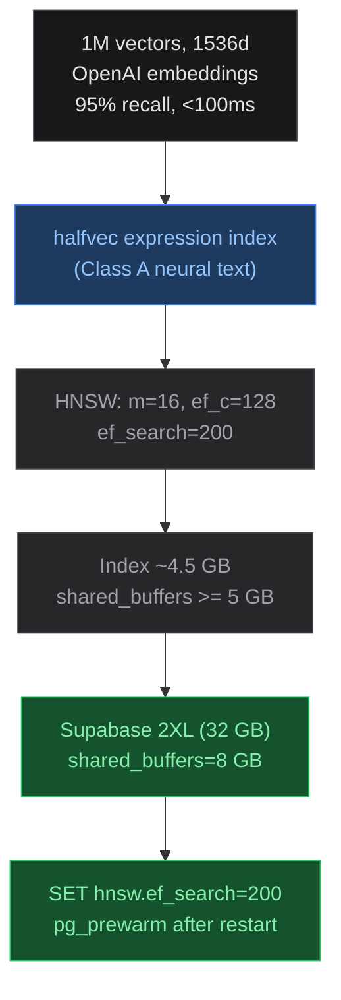
```mermaid
flowchart TD
    Start["1M vectors, 1536d\nOpenAI embeddings\n95% recall, <100ms"] --> VT["halfvec expression index\n(Class A neural text)"]
    VT --> Idx["HNSW: m=16, ef_c=128\nef_search=200"]
    Idx --> Mem["Index ~4.5 GB\nshared_buffers >= 5 GB"]
    Mem --> Tier["Supabase 2XL (32 GB)\nshared_buffers=8 GB"]
    Tier --> Config["SET hnsw.ef_search=200\npg_prewarm after restart"]

    style Start fill:#18181b,stroke:#3f3f46,color:#e4e4e7
    style VT fill:#1e3a5f,stroke:#3b82f6,color:#93c5fd
    style Idx fill:#27272a,stroke:#3f3f46,color:#a1a1aa
    style Mem fill:#27272a,stroke:#3f3f46,color:#a1a1aa
    style Tier fill:#14532d,stroke:#22c55e,color:#86efac
    style Config fill:#14532d,stroke:#22c55e,color:#86efac
```

### Common Archetypes

**Archetype 1: "High-dim text search, good-enough recall"**
- OpenAI / Cohere / BGE embeddings, 1536-3072 dims
- 95% recall, <100ms latency, moderate QPS
- **Recipe**: halfvec expression index, m=16, ef_search=200, COPY ingest
- **Cost profile**: 2x index compression via halfvec, moderate tier
- **Supabase tier**: 2XL-4XL depending on vector count

**Archetype 2: "High-dim text search, strict recall"**
- Same embeddings as above
- 99% recall, <50ms latency
- **Recipe**: halfvec expression index, m=32, ef_search=400+, pg_prewarm mandatory
- **Cost profile**: Larger index (m=32), higher shared_buffers requirement
- **Supabase tier**: 4XL+ (index must fit in shared_buffers with room to spare)

**Archetype 3: "Low-dim features, strict recall"**
- CV features, scientific embeddings, 128-960 dims
- 99% recall
- **Recipe**: vector (float32), m=32, ef_search=400+, L2 distance
- **Cost profile**: Full precision required, no halfvec compression
- **Supabase tier**: Depends on count; 1M x 960d needs 2XL+

**Archetype 4: "Massive scale, relaxed latency"**
- Any embeddings, >10M vectors
- 95% recall, >200ms latency OK
- **Recipe**: halfvec, table partitioning, read replicas, HNSW per partition
- **Cost profile**: Multiple partitions keep individual indexes manageable
- **Supabase tier**: 8XL+ or partitioned across lower tiers with read replicas

---

## Decision Traps to Avoid

1. **"25% of RAM for shared_buffers is fine"**
   Wrong for vector workloads. The HNSW index must fit in shared_buffers or you get
   40-60x latency degradation. Set shared_buffers >= index_size.

2. **"More RAM solves recall problems"**
   RAM solves latency, not recall. If recall is below target, you need higher
   ef_search or better HNSW parameters (m, ef_construction) — not more memory.

3. **"ef_search formula gives the right value"**
   The formula is a starting point. At 1M+ vectors, empirical testing consistently
   shows higher ef_search is needed, especially for STRICT recall (>98%).

4. **"I can use a direct HNSW index on 3072d vectors"**
   No. pgvector HNSW has a 2,000-dimension limit for `vector`. Use a `halfvec`
   expression index (up to 4,000 dims) or binary quantization (up to 64,000 dims).

5. **"INSERT is fine for bulk loads"**
   COPY is 4-5x faster. For 1M+ vectors, the difference is hours vs minutes.

6. **"I don't need pg_prewarm"**
   After any restart, your index is cold. The first queries will be 40-60x slower
   until the index naturally warms. pg_prewarm eliminates this cold-start penalty.

7. **"Cosine distance works for everything"**
   Classical CV features (GIST, SIFT, HOG) use L2 distance. Neural embeddings use
   Cosine. Using the wrong metric silently degrades recall.

8. **"Transaction mode pooling preserves my SET commands"**
   Supavisor in transaction mode resets session state. Use `SET LOCAL` within
   transactions or switch to session mode for persistent SET commands.

9. **"I can skip STORAGE EXTERNAL for large vectors"**
   Vectors exceeding 8 KB (roughly >2000d for float32) trigger TOAST compression by
   default. STORAGE EXTERNAL avoids compression CPU overhead while still storing
   out-of-line.

---

## Appendix: IVFFlat Parameters

If you chose IVFFlat in Stage 3, use these parameters.

### lists (number of partitions)

| Dataset Size | Recommended Lists |
|---|---|
| <= 1M rows | rows / 1000 |
| > 1M rows | sqrt(rows) |
| Minimum | 10 |

### ivfflat.probes (query-time partitions to search)

More probes = better recall, slower queries. Starting point: `sqrt(lists)`.

```sql
SET ivfflat.probes = 10;
```

| Recall Target | Probes |
|---|---|
| <= 95% (RELAXED) | 1x sqrt(lists) |
| 96-98% (MODERATE) | 2x sqrt(lists) |
| > 98% (STRICT) | 4x sqrt(lists) |

### Rebuild After Data Changes

IVFFlat centroids are computed at index creation time. As data distribution shifts,
recall degrades. Rebuild periodically:

```sql
REINDEX INDEX CONCURRENTLY items_embedding_idx;
```
