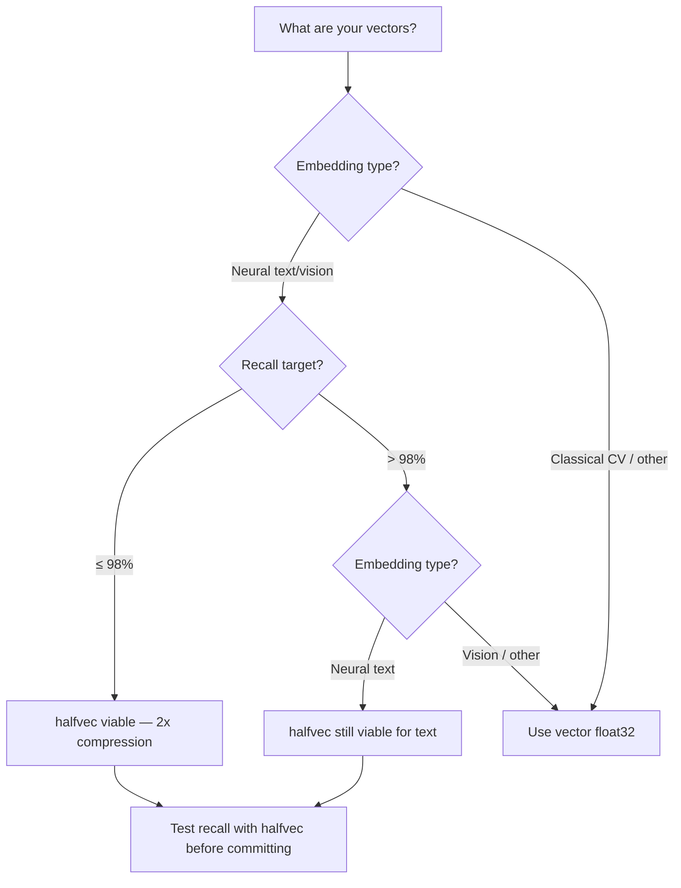
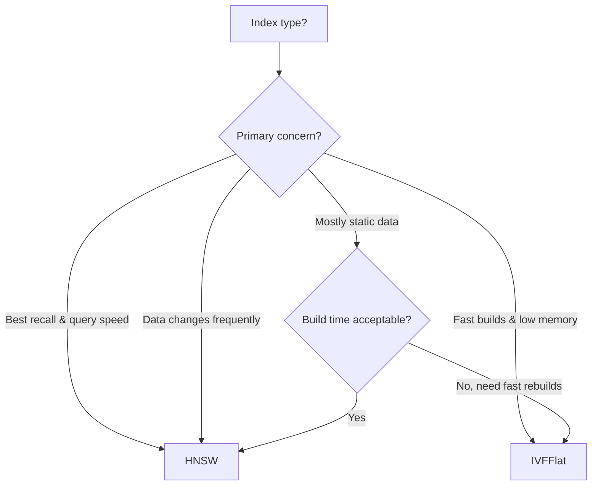
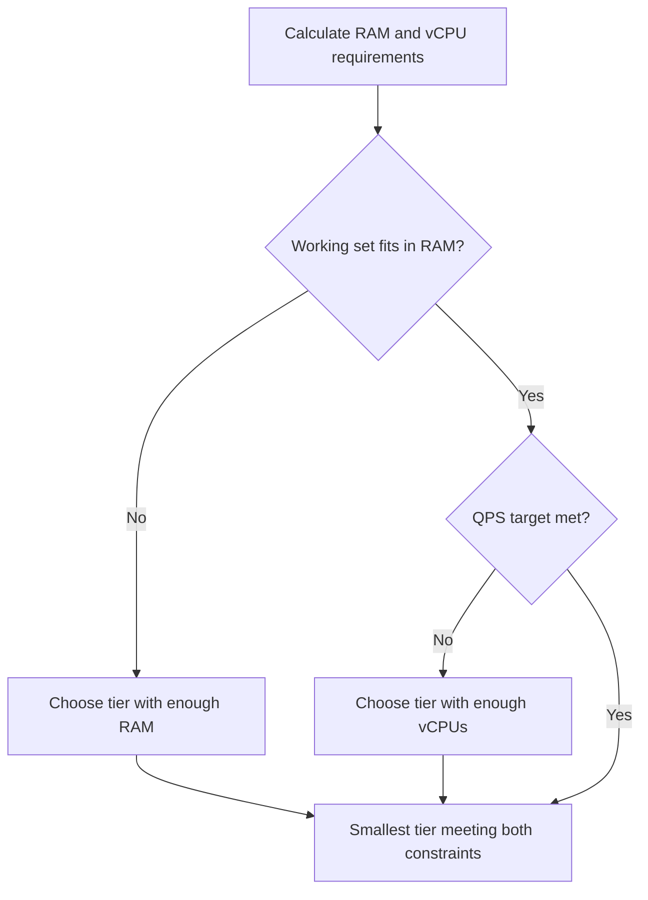

# pgvector Field Guide

A decision-tree reference for sizing and configuring PostgreSQL with the pgvector extension for vector similarity search workloads.

## Overview

pgvector is an open-source PostgreSQL extension that adds vector similarity search. It stores vectors as a native column type and supports approximate nearest neighbor (ANN) search via HNSW and IVFFlat indexes. Because it runs inside PostgreSQL, you get ACID transactions, JOINs, filtering, and standard tooling for free.

### Key Properties

- **Max dimensions**: 16,000 for `vector` and `halfvec`, 64,000 for `bit`, unlimited non-zero elements for `sparsevec`
- **Storage per element**: `vector` takes `4 * dimensions + 8` bytes, `halfvec` takes `2 * dimensions + 8` bytes
- **Index types**: HNSW (graph-based, better recall) and IVFFlat (partition-based, faster builds)
- **Distance metrics**: L2 (`<->`), cosine (`<=>`), inner product (`<#>`), L1/Manhattan (`<+>`), Hamming (`<~>`), Jaccard (`<%>`)
- **Vector types**: `vector` (float32, 4 bytes/dim), `halfvec` (float16, 2 bytes/dim), `bit` (1 bit/dim), `sparsevec` (sparse, variable)

---

## Step 1: Choose Your Vector Type



### Vector Type Decision Table

| Embedding Type | Recall Target | Recommended Type | Bytes/Dim | Notes |
|---|---|---|---|---|
| Neural text | Any | `halfvec` | 2 | Neural text embeddings tolerate float16 well |
| Neural vision | ≤ 98% | `halfvec` | 2 | Test recall; some vision models are sensitive |
| Neural vision | > 98% | `vector` | 4 | Full precision for strict recall |
| Classical CV | ≤ 95% | `halfvec` | 2 | Test carefully; GIST/SIFT may lose precision |
| Classical CV | > 95% | `vector` | 4 | Classical features need full precision at high recall |

### Storage Optimization

Always set `STORAGE PLAIN` for vector columns to avoid TOAST overhead:

```sql
ALTER TABLE my_table ALTER COLUMN embedding SET STORAGE PLAIN;
```

TOAST (The Oversized-Attribute Storage Technique) adds indirection for large values. Since vectors are fixed-size and always needed, PLAIN storage keeps them inline in the heap page, avoiding an extra I/O per row.

---

## Step 2: Choose Your Index Type



### HNSW vs IVFFlat

| Property | HNSW | IVFFlat |
|---|---|---|
| Recall at same speed | Higher | Lower |
| Build time | Slower (graph construction) | Faster (k-means + sort) |
| Build memory | Higher | Lower |
| Insert performance | Moderate (graph updates) | Poor (must rebuild for new data) |
| Query performance | Excellent | Good |
| Data drift tolerance | Good (no retraining) | Poor (centroids go stale) |

**Rule of thumb**: Use HNSW unless build time or memory is a hard constraint. IVFFlat is best for large, mostly-static datasets where you can rebuild periodically.

---

## Step 3: HNSW Parameters

### m (max connections per node)

Controls graph connectivity. Higher `m` = better recall, more memory, slower builds.

| Recall Target | Recommended m | Trade-off |
|---|---|---|
| ≤ 95% (RELAXED) | 16 | Default, good balance |
| 96-98% (MODERATE) | 24 | Better graph coverage |
| > 98% (STRICT) | 32 | Maximum connectivity |

Adjust up if `top_k` is large (≥ 50). Adjust down if `top_k` is small (≤ 10).

### ef_construction (build-time candidate list)

Controls graph quality during index creation. Higher = better graph, slower builds.

| Recall Target | Recommended ef_construction |
|---|---|
| ≤ 95% (RELAXED) | 64 |
| 96-98% (MODERATE) | 128 |
| > 98% (STRICT) | 256 |

### hnsw.ef_search (query-time candidate list)

Controls recall-speed trade-off at query time. Set per-session or per-transaction:

```sql
SET hnsw.ef_search = 100;

-- Or per-transaction:
BEGIN;
SET LOCAL hnsw.ef_search = 200;
SELECT * FROM items ORDER BY embedding <=> $1 LIMIT 10;
COMMIT;
```

**Starting point**: `ef_search = max(multiplier * top_k, floor)`

| Recall Target | Multiplier | Floor |
|---|---|---|
| ≤ 95% (RELAXED) | 2x | 40 |
| 96-98% (MODERATE) | 4x | 100 |
| > 98% (STRICT) | 8x | 200 |

### Index Build Optimization

Speed up HNSW builds with parallel workers:

```sql
SET maintenance_work_mem = '8GB';
SET max_parallel_maintenance_workers = 7;  -- plus leader = 8 total
CREATE INDEX CONCURRENTLY ON items USING hnsw (embedding vector_cosine_ops)
    WITH (m = 16, ef_construction = 128);
```

---

## Step 4: IVFFlat Parameters

### lists (number of partitions)

| Dataset Size | Recommended Lists |
|---|---|
| ≤ 1M rows | rows / 1000 |
| > 1M rows | sqrt(rows) |
| Minimum | 10 |

### ivfflat.probes (query-time partitions to search)

More probes = better recall, slower queries. Starting point: `sqrt(lists)`.

```sql
SET ivfflat.probes = 10;
```

| Recall Target | Probes Multiplier |
|---|---|
| ≤ 95% (RELAXED) | 1x sqrt(lists) |
| 96-98% (MODERATE) | 2x sqrt(lists) |
| > 98% (STRICT) | 4x sqrt(lists) |

### Important: Rebuild After Data Changes

IVFFlat centroids are computed at index creation time. As data distribution shifts, recall degrades. Rebuild periodically:

```sql
REINDEX INDEX CONCURRENTLY items_embedding_idx;
```

---

## Step 5: Distance Metrics

| Metric | Operator | Ops Class | When to Use |
|---|---|---|---|
| L2 (Euclidean) | `<->` | `vector_l2_ops` | Classical CV features, spatial data |
| Cosine | `<=>` | `vector_cosine_ops` | Neural embeddings (text, vision) |
| Inner Product | `<#>` | `vector_ip_ops` | When vectors are pre-normalized |
| L1 (Manhattan) | `<+>` | `vector_l1_ops` | Sparse features, robust to outliers |
| Hamming | `<~>` | `bit_hamming_ops` | Binary hashes |
| Jaccard | `<%>` | `bit_jaccard_ops` | Set similarity |

### halfvec Operators

When using `halfvec`, use the corresponding ops class:

| Metric | Ops Class |
|---|---|
| L2 | `halfvec_l2_ops` |
| Cosine | `halfvec_cosine_ops` |
| Inner Product | `halfvec_ip_ops` |

### sparsevec Operators

When using `sparsevec`, use the corresponding ops class:

| Metric | Ops Class |
|---|---|
| L2 | `sparsevec_l2_ops` |
| Cosine | `sparsevec_cosine_ops` |
| Inner Product | `sparsevec_ip_ops` |

### Expression Indexing for halfvec

You can store full-precision vectors but index as halfvec for 2x index compression:

```sql
-- Table stores float32
CREATE TABLE items (
    id bigserial PRIMARY KEY,
    embedding vector(1536)
);

-- Index uses halfvec (2x smaller)
CREATE INDEX ON items USING hnsw ((embedding::halfvec(1536)) halfvec_cosine_ops);

-- Queries must cast to match
SELECT * FROM items ORDER BY embedding::halfvec(1536) <=> $1::halfvec(1536) LIMIT 10;
```

---

## Step 6: PostgreSQL Memory Configuration

pgvector performance is heavily influenced by PostgreSQL memory settings. Vectors and indexes must fit in memory for best performance.

### shared_buffers

PostgreSQL's main buffer pool. Should hold the index + hot table data.

**Rule of thumb**: 25% of total RAM, but ensure it can hold your HNSW/IVFFlat index.

```sql
SHOW shared_buffers;
-- Set in postgresql.conf:
-- shared_buffers = '8GB'
```

### effective_cache_size

Tells the query planner how much memory is available (shared_buffers + OS page cache).

**Rule of thumb**: 75% of total RAM.

```sql
-- effective_cache_size = '24GB'
```

### maintenance_work_mem

Memory available for index creation and VACUUM. Critical for HNSW builds.

**Rule of thumb**: For HNSW builds, set to 1.5x the expected index size, minimum 1GB.

```sql
SET maintenance_work_mem = '8GB';
```

### work_mem

Per-operation sort/hash memory. Affects query performance.

**Rule of thumb**: total_ram / (4 * max_connections), minimum 64MB for vector workloads.

### Parallel Workers

| Setting | Purpose | Recommendation |
|---|---|---|
| `max_parallel_workers_per_gather` | Query parallelism | total_vcpus / 4, max 4 |
| `max_parallel_maintenance_workers` | Index build parallelism | total_vcpus / 2, max 7 |

---

## Step 7: Memory Sizing

### Table Size

```
table_bytes = num_vectors * (dimensions * bytes_per_dim + tuple_overhead)
```

Where:
- `bytes_per_dim`: 4 for `vector`, 2 for `halfvec`
- `tuple_overhead`: ~36 bytes (heap tuple header + alignment + ItemPointer)

### HNSW Index Size

```
index_bytes ≈ num_vectors * (2 * m * 8 + dimensions * bytes_per_dim) * 1.2
```

The index stores a copy of each vector plus the graph structure (~2 * m neighbor pointers at 8 bytes each). The 1.2 multiplier accounts for internal overhead.

### IVFFlat Index Size

```
index_bytes ≈ table_bytes * 1.1 + lists * dimensions * bytes_per_dim
```

IVFFlat re-stores vectors in list buckets plus centroid data.

### Total RAM Requirement

```
effective_cache_size (index + table data)
+ PostgreSQL overhead (~512 MB)
+ OS reserve (~1 GB)
= total RAM needed
```

Round up to the nearest available instance size.

---

## Step 8: Compute Tier Selection

### Supabase Compute Tiers

Supabase provides managed PostgreSQL with pgvector pre-installed. Each project runs on a dedicated Postgres instance that can be scaled across these compute tiers:

| Tier | CPU | RAM | Monthly | CPU Type |
|---|---|---|---|---|
| Micro | 2-core ARM | 1 GB | ~$10 | Shared |
| Small | 2-core ARM | 2 GB | ~$15 | Shared |
| Medium | 2-core ARM | 4 GB | ~$60 | Shared |
| Large | 2-core ARM | 8 GB | ~$110 | Dedicated |
| XL | 4-core ARM | 16 GB | ~$210 | Dedicated |
| 2XL | 8-core ARM | 32 GB | ~$410 | Dedicated |
| 4XL | 16-core ARM | 64 GB | ~$800 | Dedicated |
| 8XL | 32-core ARM | 128 GB | ~$1,600 | Dedicated |
| 12XL | 48-core ARM | 192 GB | ~$2,400 | Dedicated |
| 16XL | 64-core ARM | 256 GB | ~$3,200 | Dedicated |

**Shared CPU** (Micro–Medium): suitable for development, small datasets, and low-QPS workloads.
**Dedicated CPU** (Large+): required for production vector search workloads. Consistent performance without noisy-neighbor effects.

### Selection Logic



Pick the smallest Supabase tier where both vCPUs and RAM meet your requirements. For production workloads, start at **Large** or above for dedicated CPU.

---

## Step 9: Scaling Strategies

### Read Replicas

For read-heavy workloads, add read replicas to distribute query load:

- Supabase supports read replicas for distributing query load
- Each replica can serve independent query traffic
- Near-linear QPS scaling for read-only workloads

### Table Partitioning

For very large datasets (>10M vectors), consider partitioning:

```sql
-- Range partition by ID
CREATE TABLE items (
    id bigserial,
    embedding vector(1536)
) PARTITION BY RANGE (id);

CREATE TABLE items_p1 PARTITION OF items FOR VALUES FROM (1) TO (5000001);
CREATE TABLE items_p2 PARTITION OF items FOR VALUES FROM (5000001) TO (10000001);

-- Each partition gets its own index
CREATE INDEX ON items_p1 USING hnsw (embedding vector_cosine_ops);
CREATE INDEX ON items_p2 USING hnsw (embedding vector_cosine_ops);
```

### Connection Pooling

pgvector queries hold connections during search. Supabase includes built-in connection pooling (Supavisor) for high-concurrency workloads.

---

## Step 10: Operational Considerations

### VACUUM and Index Maintenance

- Regular `VACUUM` prevents table bloat and updates visibility maps
- For IVFFlat, `REINDEX` when data distribution shifts significantly
- HNSW indexes self-maintain but benefit from `VACUUM` to reclaim dead tuples

```sql
-- Analyze table statistics for query planner
ANALYZE items;

-- Vacuum to reclaim space
VACUUM items;

-- Reindex if needed (IVFFlat or after major deletes)
REINDEX INDEX CONCURRENTLY items_embedding_idx;
```

### Monitoring

Key metrics to watch:

| Metric | Target | Action if Exceeded |
|---|---|---|
| Cache hit ratio | > 99% | Increase shared_buffers or RAM |
| Index scans vs seq scans | Index scans dominant | Check index is being used |
| Tuple fetches | Low relative to scans | Index is filtering well |
| WAL generation rate | Stable | Check write patterns |

```sql
-- Cache hit ratio
SELECT
    sum(heap_blks_hit) / nullif(sum(heap_blks_hit) + sum(heap_blks_read), 0) AS cache_hit_ratio
FROM pg_statio_user_tables;

-- Index usage
SELECT
    indexrelname,
    idx_scan,
    idx_tup_read,
    idx_tup_fetch
FROM pg_stat_user_indexes
WHERE schemaname = 'public';
```

### Iterative Scan for Filtered Queries

When combining vector search with WHERE clauses, pgvector supports iterative scanning. Both HNSW and IVFFlat indexes support this feature.

**HNSW iterative scan:**

```sql
-- strict_order: exact distance ordering (safer, may be slower)
SET hnsw.iterative_scan = strict_order;

-- relaxed_order: allows minor reordering (faster, still high recall)
SET hnsw.iterative_scan = relaxed_order;

-- Limit how many tuples the scan examines (safety valve)
SET hnsw.max_scan_tuples = 50000;

SELECT * FROM items
WHERE category = 'electronics'
ORDER BY embedding <=> $1
LIMIT 10;
```

**IVFFlat iterative scan:**

```sql
SET ivfflat.iterative_scan = relaxed_order;

-- Limit how many lists the scan probes
SET ivfflat.max_probes = 100;

SELECT * FROM items
WHERE category = 'electronics'
ORDER BY embedding <=> $1
LIMIT 10;
```

Iterative scan re-scans the index with increasing search scope until enough matching rows are found.

---

## Quick Reference: Sizing Cheat Sheet

| Vectors | Dimensions | Type | Table Size | HNSW Index (m=16) | Min RAM |
|---|---|---|---|---|---|
| 100K | 768 | vector | ~330 MB | ~500 MB | 8 GB |
| 100K | 1536 | vector | ~620 MB | ~880 MB | 8 GB |
| 1M | 768 | vector | ~3.2 GB | ~4.8 GB | 16 GB |
| 1M | 1536 | vector | ~6.1 GB | ~8.6 GB | 32 GB |
| 1M | 3072 | vector | ~12 GB | ~17 GB | 64 GB |
| 1M | 1536 | halfvec | ~3.1 GB | ~4.5 GB | 16 GB |
| 1M | 3072 | halfvec | ~6.1 GB | ~8.7 GB | 32 GB |
| 10M | 768 | vector | ~32 GB | ~48 GB | 128 GB |
| 10M | 1536 | halfvec | ~31 GB | ~45 GB | 128 GB |

*Sizes are approximate. Actual sizes depend on TOAST settings, fill factor, and index parameters.*
