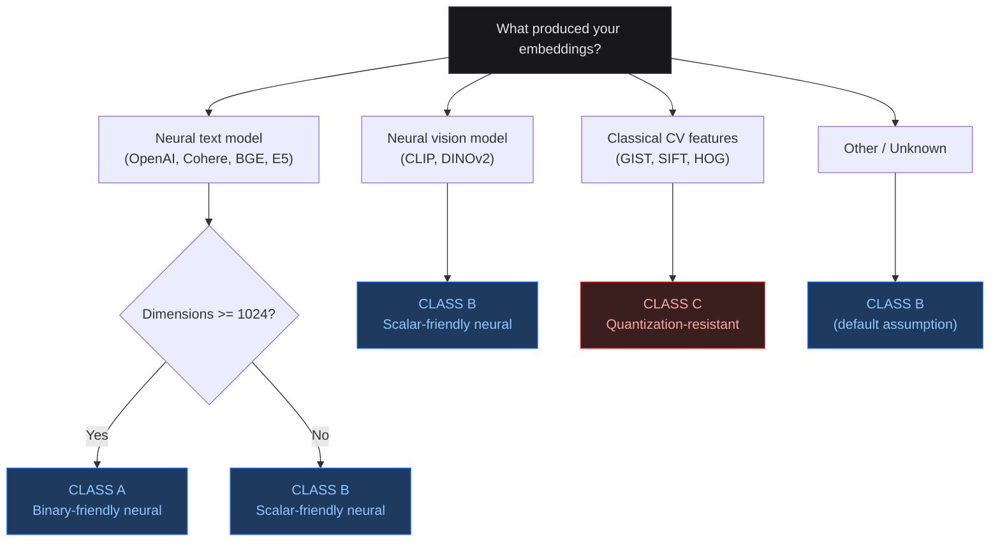
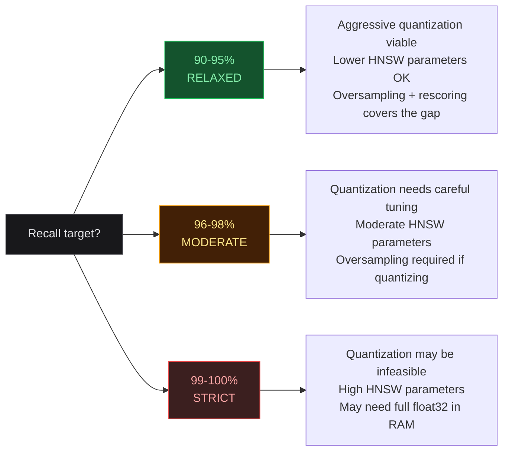
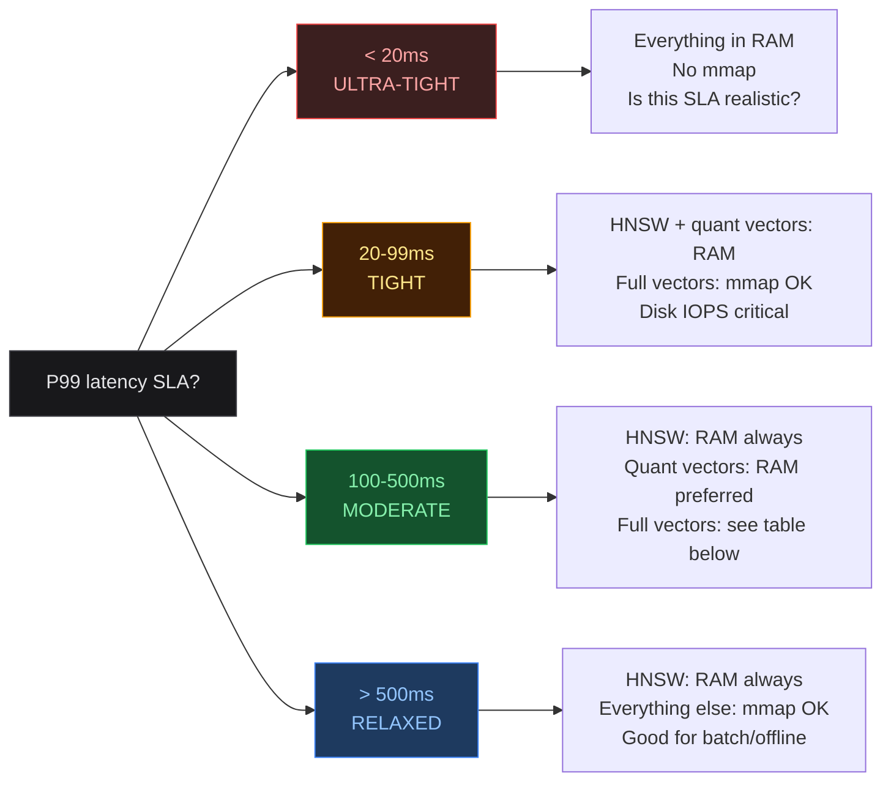
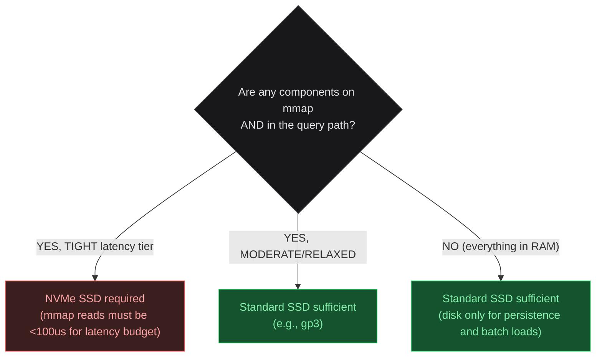
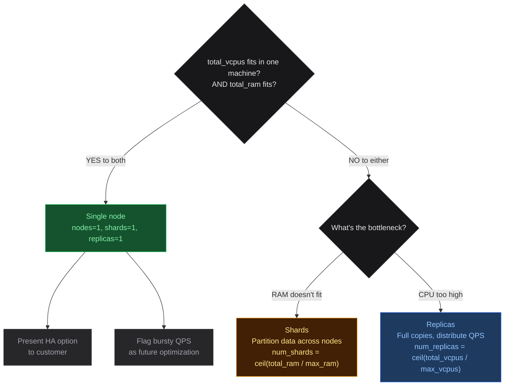
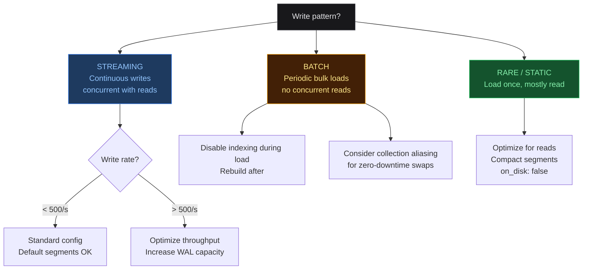

# Qdrant Vector Database Architecture Field Guide

## How to Use This Guide

Start at **Stage 1** and work through each stage sequentially. Each stage narrows your
design space. By the end, you'll have a concrete starting architecture you can benchmark
and refine.

### Design Philosophy

This guide produces a **conservative initial estimate** — a defensible starting point
for a customer conversation, not a final production configuration. The principles:

1. **Conservative over optimal.** Where expert opinion splits (e.g., quantization
   strategy, HNSW parameter tuning), this guide chooses the safer option. The result
   may over-provision slightly, but it will not under-deliver on SLAs. Aggressive
   optimizations (binary quantization, lower m, reduced ef) are flagged as future
   refinements to explore after benchmarking validates the baseline.

2. **Minimum viable infrastructure.** Topology decisions (replication, sharding)
   are customer decisions driven by business requirements (HA, compliance, cost
   tolerance), not sizing decisions. This guide produces a single-node architecture
   that meets the SLA, then presents multi-node options as recommendations.

3. **Benchmark, then optimize.** The output of this guide is a starting architecture
   to load-test. Real-world performance depends on data distribution, access patterns,
   and hardware specifics that no formula can fully capture. Expect to tune hnsw_ef,
   oversampling, and instance size after benchmarking. The guide's values are chosen
   to be good enough to pass initial benchmarks, not to be globally optimal.

### Prerequisites

The guide assumes you already know:
- Your dataset size (number of vectors)
- Your embedding dimensions and origin
- Your SLA requirements (QPS, latency, recall)
- Your read/write patterns

---

## Stage 1: Classify Your Embeddings

This determines your quantization options (the single biggest cost lever) and your
distance metric.



**Embedding class details:**

| Class | Type | Distance Metric | Qdrant `distance` | Properties |
|-------|------|----------------|-------------------|------------|
| **A** | Neural text, dims >= 1024 | Cosine | `"Cosine"` | Centered near zero, well-distributed. All quantization strategies viable. Binary quantization dramatically reduces cost. _Some models (e.g., OpenAI text-embedding-3-large) support Matryoshka dimension reduction — test truncation against recall target._ |
| **B** | Neural text (dims < 1024), neural vision, or unknown | Cosine | `"Cosine"` | Binary may lose signal. Scalar quantization is the best compression tool. For vision models, verify distance metric with model docs. Alternative: use `"Dot"` if model was trained with dot-product objective. |
| **C** | Classical CV features (GIST, SIFT, HOG) | Euclidean (L2) | `"Euclid"` | Non-negative, magnitude-heavy, not centered at zero. Quantization-resistant. May need full float32 in RAM for high recall. Using Cosine on non-normalized features gives wrong results. Qdrant also supports `"Manhattan"` for L1. |

**Record: your Embedding Class and your Distance Metric (Qdrant `distance` value).**

---

## Stage 2: Determine Your Recall Regime

This determines how hard the algorithm has to work and how much precision you need
in your distance calculations.



**Boundary rule:** 95% is RELAXED. 96% is MODERATE. 99% is STRICT.

### Quantization Feasibility Matrix

Cross-reference your Embedding Class (Stage 1) with your Recall Regime (Stage 2).
This table tells you WHICH quantization method to use. The specific oversampling
factor is set later in Stage 3d — do not pick an oversampling value from this table.

| Embedding Class | RELAXED (90-95%) | MODERATE (96-98%) | STRICT (99-100%) |
|-----------------|------------------|-------------------|------------------|
| **CLASS A** (binary-friendly) | Scalar, rescore: ON | Scalar, rescore: ON | Scalar, or no quantization; rescore: ON (if scalar) |
| **CLASS B** (scalar-friendly) | Scalar, rescore: ON | Scalar, rescore: ON | No quantization (full float32 in RAM) |
| **CLASS C** (quant-resistant) | Scalar (test it), rescore: ON | No quantization (full float32) | No quantization (full float32) |

> **NOTE on Binary Quantization:** For CLASS A embeddings, binary quantization
> offers 32x compression (vs scalar's 4x) and can be effective for high-dim
> neural embeddings. However, expert opinion is split on whether binary is
> reliable enough for production use at top-k >= 50. This guide defaults to
> scalar quantization as the conservative choice. Consider binary quantization
> as a FUTURE OPTIMIZATION after validating scalar meets your requirements —
> especially when RAM savings are critical and top-k is small (< 20).

**Qdrant quantization_config examples:**

```json
{"scalar": {"type": "int8", "quantile": 0.99, "always_ram": true}}
```

```json
{"binary": {"always_ram": true}}
```

```json
{"product": {"compression": "x32", "always_ram": true}}
```

```text
None: omit quantization_config entirely
```

Qdrant also supports Product Quantization (up to 64x compression), but it has
higher indexing cost and lower recall than scalar. Use only when memory is the
absolute top priority and recall loss is acceptable.

**Record: your quantization method (Binary, Scalar, or None) and whether rescore is ON.**

---

## Stage 3: Set HNSW Parameters

You need these values before you can size memory or compute, so set them now.

**Qdrant parameter mapping:**
- `m` and `ef_construct` are set in `hnsw_config` at collection creation
- Search-time ef is called **`hnsw_ef`** in Qdrant (set per-query in `search_params`)
- Qdrant defaults: m=16, ef_construct=100, full_scan_threshold=10000

### Step 3a: Choose m

```text
Qdrant parameter: hnsw_config.m (set at collection creation)
Qdrant default: 16
```

| RECALL REGIME | m | RULE |
|---------------|---|------|
| RELAXED | 16 | Fixed. Go to 12 only if memory-constrained after completing Stage 5 and needing to cut. |
| MODERATE | 20 | Fixed. |
| STRICT | 32 | Fixed. |

```text
Top-k adjustment: large top-k values require denser graph connectivity
because the search must find more true neighbors, not just the closest one.
  If top_k >= 50:  increase m by one tier
    RELAXED 16 -> 20,  MODERATE 20 -> 28,  STRICT stays at 32
  If top_k <= 20:  decrease m by one tier (minimum m=16)
    STRICT 32 -> 24,   MODERATE 20 -> 16,  RELAXED stays at 16

Rarely go above 32 — diminishing returns.
```

### Step 3b: Choose ef_construct

```text
Qdrant parameter: hnsw_config.ef_construct (set at collection creation)
Qdrant default: 100

ef_construct only affects index build time, not query time or RAM.
You pay this cost once.
```

| RECALL REGIME | ef_construct | RULE |
|---------------|-------------|------|
| RELAXED | 200 | Fixed. (Above Qdrant's default of 100.) |
| MODERATE | 256 | Fixed. |
| STRICT | 400 | Fixed. Go to 512 only if benchmarks show recall is still below target after tuning ef. |

```text
Exception: if your write pattern is BATCH (no concurrent reads during
writes), use 400 for STRICT regardless. The extra build time costs
nothing when there are no queries to slow down. (400 is sufficient
for 99% recall; 512 is available as a benchmark-driven escalation
if recall falls short.)
```

### Step 3c: Choose hnsw_ef (search-time) — PRELIMINARY

Set a starting value now for compute estimation. You will refine this during
benchmarking.

```text
Qdrant parameter: search_params.hnsw_ef (set per-query, not at collection level)
  Example: client.query_points(..., search_params={"hnsw_ef": 200})

hnsw_ef must be >= top_k (hard constraint)
```

| RECALL REGIME | STARTING hnsw_ef | RULE |
|---------------|-----------------|------|
| RELAXED | 2x top_k | Fixed multiplier. |
| MODERATE | 3x top_k | Fixed multiplier. |
| STRICT | 6x top_k | Fixed multiplier. |

```text
Apply floor based on recall regime:
  RELAXED:   hnsw_ef = max(calculated_ef, 64)
  MODERATE:  hnsw_ef = max(calculated_ef, 64)
  STRICT:    hnsw_ef = max(calculated_ef, 128)

The floor ensures a minimum search width. Small top_k values (e.g., 10)
produce calculated ef values too low for effective graph traversal,
especially at STRICT recall targets where the graph must be explored
thoroughly. Use the floor-adjusted ef value (not the calculated value)
for all subsequent stages including compute estimation in Stage 7a.

NOTE: Qdrant also has full_scan_threshold (default 10000 KB). If a
segment is smaller than this, Qdrant uses brute-force scan instead of
HNSW. This is relevant for streaming writes: newly ingested vectors in
small mutable segments are searched via brute force, not HNSW. This is
fast for small segments (<20K vectors) and the hnsw_ef parameter does
not apply to them.

hnsw_ef is your primary runtime tuning knob. After benchmarking:
  - If recall is below target: increase hnsw_ef.
  - If latency is above SLA: decrease hnsw_ef (and accept lower recall,
    or improve quantization/graph quality instead).
```

### Step 3d: Choose Oversampling (if quantizing)

```text
Qdrant parameter: search_params.quantization.oversampling (set per-query)
  Must be paired with: search_params.quantization.rescore = true
  Example:
    client.query_points(..., search_params={
      "hnsw_ef": 200,
      "quantization": {"rescore": true, "oversampling": 2.0}
    })

  NOTE: Qdrant also supports quantization.ignore = true to bypass
  quantization entirely for a specific query (uses full vectors).

Only applies when using quantization + rescoring from Stage 2.
If your quantization method is "None," skip this step.
```

| QUANTIZATION | RECALL REGIME | OVERSAMPLING FACTOR |
|-------------|---------------|---------------------|
| Scalar | RELAXED | 2.0x |
| Scalar | MODERATE | 2.5x |
| Scalar | STRICT | 4.0x |

```text
If exploring binary quantization as a future optimization (see Stage 2 NOTE):
```

| QUANTIZATION | RECALL REGIME | OVERSAMPLING FACTOR |
|-------------|---------------|---------------------|
| Binary | RELAXED | 3.0x |
| Binary | MODERATE | 4.0x |
| Binary | STRICT | Not recommended (use scalar or none) |

```text
rescore_candidates = oversampling_factor x top_k
These candidates are re-ranked using full-precision vectors.
```

---

## Stage 4: Assess Your Latency Budget

This determines what can live on disk vs. what must be in RAM.



**Boundary rule:** exact boundary values belong to the lower tier. 20ms = TIGHT. 100ms = MODERATE. 500ms = MODERATE.

### Storage Placement Decision Table

Cross-reference Latency Tier with your components.

**Qdrant storage configuration:**
- Vectors on disk: set `on_disk: true` inside `vectors_config` (per-vector parameter)
    Example: vectors={"size": 3072, "distance": "Cosine", "on_disk": true}
- HNSW index on disk: set `on_disk: true` inside `hnsw_config`
- Quantized vectors in RAM: set `always_ram: true` inside `quantization_config`
- Automatic mmap promotion: configure `memmap_threshold` in `optimizers_config`
    (segments larger than this threshold in KB are automatically converted to mmap)

**No-quantization promotion rule**: If your quantization strategy from Stage 2 is
"no quantization," there are no separate quantized vectors — the full vectors ARE
the search vectors, and every distance calculation reads them. In this case, promote
full vectors one tier toward RAM (marked with * below).

| Component | ULTRA-TIGHT | TIGHT | MODERATE | RELAXED |
|-----------|-------------|-------|----------|---------|
| HNSW index | RAM | RAM | RAM | RAM |
| Quantized vectors | RAM | RAM | RAM or mmap | mmap OK |
| Full vectors | RAM | mmap (NVMe) | mmap (SSD) | mmap (SSD) |
| *if no quant: | RAM | RAM | RAM* | mmap (SSD) |
| Payload/metadata | RAM | RAM or mmap | mmap | mmap |

```text
"RAM or mmap" = use RAM. Only fall back to mmap if RAM budget is exceeded
after completing Stage 5.

* = When there is no quantization layer, every search query reads full vectors
    directly. mmap adds per-query I/O latency that compounds with high ef values.
    Promoting to RAM avoids this.

Qdrant implementation:
  "RAM" = on_disk: false (default) for vectors; always_ram: true for quantized
  "mmap" = on_disk: true for vectors; or rely on memmap_threshold auto-promotion
  "HNSW in RAM" = hnsw_config.on_disk: false (default)
```

---

## Stage 5: Size Your Memory

### Step 5a: Vector Memory

```text
Pick your quantization strategy from Stage 2 and calculate:

NO QUANTIZATION (float32):
  vector_memory = num_vectors x dimensions x 4 bytes

SCALAR QUANTIZATION (int8):
  quantized_memory = num_vectors x dimensions x 1 byte
  full_vector_memory = num_vectors x dimensions x 4 bytes  (for rescore, may be on disk)

BINARY QUANTIZATION (1-bit):
  quantized_memory = num_vectors x dimensions / 8
  full_vector_memory = num_vectors x dimensions x 4 bytes  (for rescore, may be on disk)
```

### Step 5b: HNSW Index Memory

```text
Use the m value you chose in Stage 3, Step 3a.

hnsw_memory = num_vectors x m x 2 x 8 bytes x 1.1

The formula: each vector has up to m bidirectional links at layer 0
(so m x 2 link slots), each stored as an 8-byte reference. The 1.1
multiplier (10%) accounts for the multi-level HNSW structure: a small
fraction of nodes are promoted to higher layers with additional links.

NOTE: This is a theoretical approximation. Qdrant does not publish
their exact graph memory layout. The formula is derived from the
original HNSW paper and is a reasonable estimate for sizing purposes.

Common values (per 1M vectors):
  m=16:  1,000,000 x 256 x 1.1 ≈ 282 MB
  m=20:  1,000,000 x 320 x 1.1 ≈ 352 MB
  m=32:  1,000,000 x 512 x 1.1 ≈ 563 MB
```

### Step 5c: Page Cache Budget

```text
If any component is placed on mmap (from Stage 4 Storage Placement Table),
the OS uses page cache to keep frequently accessed pages in RAM. Budget
for this explicitly.

For full vectors on mmap (with quantization — rescore path only):
  page_cache = 0.10 x full_vector_memory
  (10% cache hit rate is usually sufficient because rescoring accesses
  a small, somewhat random subset of vectors per query)

For full vectors on mmap (WITHOUT quantization — every search reads them):
  page_cache = 0.30 x full_vector_memory
  (30% — higher because search traversal has some locality)

For quantized vectors on mmap:
  page_cache = 0.50 x quantized_memory
  (50% — quantized vectors are small and heavily accessed)

If everything is in RAM (no mmap components):
  page_cache = 0
```

### Step 5d: Process Overhead

```text
process_overhead = 500 MB (fixed)

This covers:
  - Qdrant server process (heap, thread stacks, buffers)
  - Point ID mapping and internal data structures
  - Payload index (for moderate payloads; add more if payloads are large)
  - OS kernel and system services
```

### Step 5e: Total RAM

```text
total_ram = ram_components + page_cache + process_overhead + merge_headroom

Where:
  ram_components = sum of (components placed in RAM from Stage 4 table)
                   This includes: HNSW index + quantized vectors (if RAM)
                   + full vectors (if RAM)

  page_cache = from Step 5c

  process_overhead = 500 MB (from Step 5d)

  merge_headroom = ram_components x 0.10
    (10% — during segment merges, old and new data coexist briefly in RAM)

Round up to the nearest standard instance RAM tier:
  4 GB, 8 GB, 16 GB, 32 GB, 64 GB, 128 GB, 256 GB
```

---

## Stage 6: Size Your Disk

Disk is sized separately from RAM. Everything persists to disk regardless of whether
it's also in RAM (Qdrant uses disk as the durable backing store).

### Step 6a: Base Disk

```text
base_disk = full_vector_memory + quantized_memory + hnsw_on_disk

Where:
  full_vector_memory = num_vectors x dimensions x 4 bytes  (always stored on disk)
  quantized_memory   = size of quantized vectors (0 if no quantization)
  hnsw_on_disk       = hnsw_memory (index is persisted to disk even if loaded into RAM)
```

### Step 6b: WAL (Write-Ahead Log) Space

```text
Qdrant uses a WAL for durability. Configuration (in qdrant config YAML):
  wal:
    wal_capacity_mb: 32        # size per WAL segment (default 32 MB)
    wal_segments_ahead: 0      # pre-created segments for write perf (default 0)

WAL accumulates writes before they're flushed to segments.

STREAMING writes:
  wal_space = 2 GB
  (Sufficient for most streaming workloads up to 500 writes/s.
  For >500/s, use: peak_write_rate x avg_vector_bytes x 60 seconds x 2)

BATCH writes:
  wal_space = batch_size x avg_vector_bytes x 2
  Where avg_vector_bytes = dimensions x 4 (float32 size per vector).
  The x2 accounts for WAL segments coexisting before compaction.
  Apply floor: wal_space = max(calculated, 1 GB)

RARE/STATIC writes:
  wal_space = 1 GB (minimal, just for operational headroom)
```

### Step 6c: Operational Headroom

```text
Disk operations that temporarily require extra space:

segment_merge_overhead = base_disk x 0.50
  (During merges, old and new segments coexist. Worst case is a full
  rebuild = 1.0x, but 0.5x covers typical incremental merges.)

snapshot_space = base_disk x 1.0
  (One full snapshot for backup/recovery. Set to 0 if snapshots are
  stored externally or not used.)
```

### Step 6d: Total Disk

```text
total_disk = base_disk + wal_space + segment_merge_overhead + snapshot_space

Minimum recommended: 30 GB (to avoid running into filesystem overhead
on very small datasets).
```

### Step 6e: Disk Type



---

## Stage 7: Size Your Compute (vCPUs)

### Step 7a: Estimate Per-Query CPU Time

Per-query time depends on the **absolute value of ef** (not the ratio ef/top_k)
and the cost of each distance computation (driven by dimensions and quantization).

**Step 1: Look up base distance computation cost per query.**

| Dimensions | Binary quant | Scalar quant | No quant (float32) |
|------------|-------------|-------------|-------------------|
| dims < 512 | ~0.3ms | ~0.5ms | ~1.0ms |
| dims 512-1024 | ~0.5ms | ~1.0ms | ~2.0ms |
| dims 1024-2048 | ~0.8ms | ~1.5ms | ~3.0ms |
| dims 2048-4096 | ~1.0ms | ~2.0ms | ~5.0ms |

```text
These assume:
  - ef = 64 (the reference point for all adjustments below)
  - Warm cache (data in RAM or OS page cache)
  - Single-threaded per query
  - Includes graph traversal overhead (memory access, pointer chasing)
  - Does NOT include rescoring (added separately below)
```

**Step 2: Adjust for your actual ef value.**

```text
The relationship between ef and query time is roughly linear (not
exactly, due to early termination, but close enough for sizing).

ef_adjustment = your_ef / 64

per_query_base = table_value x ef_adjustment

Examples:
  ef = 64:   adjustment = 1.0x (baseline)
  ef = 128:  adjustment = 2.0x
  ef = 200:  adjustment = 3.1x
  ef = 256:  adjustment = 4.0x
  ef = 512:  adjustment = 8.0x
```

**Step 3: Add rescoring cost (if quantizing).**

```text
If using quantization with rescoring:
  rescore_candidates = oversampling_factor x top_k  (from Stage 3d)

  If full vectors are in RAM:
    rescore_time = rescore_candidates x dimensions x 4 bytes / 10_000_000_000
    (Rough model: 10 GB/s effective throughput for in-RAM float32 dot products)
    In practice this is <0.1ms for most configurations. Use 0.1ms as floor.

  If full vectors are on mmap (disk):
    rescore_time = rescore_candidates x 0.01ms  (per-candidate disk read + compute)
    Example: 200 candidates x 0.01ms = 2.0ms

If NOT using quantization (no rescore step):
  rescore_time = 0
```

**Step 4: Add mmap overhead (if applicable).**

```text
If full vectors are on mmap AND no quantization (every search reads disk):
  mmap_overhead = 1.0ms
  (Random I/O pattern during graph traversal; page cache helps but misses add up)

Otherwise:
  mmap_overhead = 0
```

**Step 5: Total per-query time.**

```text
per_query_time = per_query_base + rescore_time + mmap_overhead
```

### Step 7b: Calculate Required Cores for QPS

```text
cores_for_queries = target_QPS x per_query_time_seconds

Then add headroom based on latency tier and write pattern:

  If TIGHT latency tier AND STREAMING writes:
    headroom_cores = cores_for_queries x 1.0  (100% headroom)
    (Streaming writes cause segment merges and lock contention that
    amplify tail latency. The tight P99 budget leaves no room for
    write-induced spikes. This is the single largest source of
    expert variance — production systems consistently need more
    headroom here than steady-state math suggests.)

  If TIGHT latency tier AND BATCH/STATIC writes:
    headroom_cores = cores_for_queries x 0.50  (50% headroom)

  Otherwise (MODERATE, RELAXED, ULTRA-TIGHT):
    headroom_cores = cores_for_queries x 0.30  (30% headroom)

This headroom covers: GC pauses, OS scheduling, background tasks,
and the gap between average and P99 query times.
```

### Step 7c: Account for Write Load

```text
If concurrent reads + writes (STREAMING pattern):
  Indexing time per vector (use these fixed values):
    m=12: 1.0ms    m=16: 1.5ms    m=20: 2.5ms
    m=28: 3.5ms    m=32: 4.0ms

  write_cores = peak_write_rate x indexing_time_per_vector_seconds

If batch writes (no concurrent reads):
  write_cores = 0
  Size for peak read QPS only. Writes use the same cores during off-peak.
```

### Step 7d: Total vCPUs

```text
total_vcpus = cores_for_queries + headroom_cores + write_cores

Round up to the nearest whole number.
Minimum recommended: 4 vCPUs (to allow OS, Qdrant, and at least 2 query threads).
```

### Step 7e: Single Node or Multiple?



**Single node is the default.** Topology is a CUSTOMER DECISION, not a sizing decision.
This guide produces the minimum viable infrastructure. Replication is a business/SLA
decision the customer makes after reviewing your initial architecture.

- **HA option:** Present as a recommendation — "add `replication_factor=2` for failover.
  Doubles infrastructure cost but prevents SLA breach during node failure. Recommended
  if the P99 SLA is contractual." Record under Future Optimizations.
- **Bursty QPS:** If peak QPS occurs in a defined window (e.g., 6 hours/day), the node
  will be idle outside that window. This is expected. Scaling replicas up/down is a cost
  optimization to explore AFTER validating the single-node architecture works.
- **Shards:** Each query must hit all shards, adding ~2-5ms network latency. Use only
  when data doesn't fit in one node's RAM.
- **Replicas:** Each replica needs `total_ram`, so total cost = replicas x node cost.

**Qdrant collection creation parameters:**

| Parameter | Purpose |
|-----------|---------|
| `shard_number` | Number of shards (set at creation, manual choice) |
| `replication_factor` | Copies per shard (e.g., 2 = primary + 1 replica) |
| `write_consistency_factor` | Replicas that must ACK a write before responding (must be <= `replication_factor`; set to 1 for async replication) |

---

## Stage 8: Tune for Write Pattern



**STREAMING (< 500/s):** Standard configuration. Qdrant handles background merging
automatically via three optimizers: Merge (combines small segments), Vacuum (reclaims
deleted records), and Indexing (promotes segments to HNSW + mmap). Key config:
`optimizers_config.flush_interval_sec` (default: 5).

**STREAMING (> 500/s):** Increase WAL capacity (`wal.wal_capacity_mb`, default 32),
increase `wal.wal_segments_ahead` for write buffering, consider larger `memmap_threshold`.
Monitor segment count — too many small segments hurts read performance.

**BATCH:** "No concurrent reads" is functionally equivalent to "offline during load."

- **Preferred:** Set `hnsw_config.m = 0` at collection creation to disable HNSW graph
  construction during bulk load. After loading, update the collection to set m to your
  target value — Qdrant rebuilds the HNSW index automatically.
- **Alternative:** Set `optimizers_config.indexing_threshold = 0` to defer indexing.
  (NOTE: 0 = disabled. This is the opposite of what you might expect.)
- Set `max_optimization_threads` high during rebuild (null = dynamic CPU saturation).
- Consider **collection aliasing** for zero-downtime reindexing:

```json
{
  "actions": [
    {"delete_alias": {"alias_name": "production"}},
    {"create_alias": {"collection_name": "new_v2", "alias_name": "production"}}
  ]
}
```

Multiple actions in one request are executed atomically. Enables rollback.

**RARE / STATIC:** Optimize entirely for reads. Compact segments after initial load.
Set `on_disk: false` for everything that fits in RAM. No write headroom needed in CPU.

---

## Stage 9: Select Instance and Estimate Cost

### Step 9a: Map Requirements to Instance Type

```text
From your calculations:
  - total_vcpus (Stage 7d)
  - total_ram (Stage 5e)
  - total_disk (Stage 6d)
  - disk_type (Stage 6e)
```

| Constraint | Instance Family | AWS Examples | GCP Examples | Azure Examples |
|------------|----------------|-------------|-------------|----------------|
| Memory-bound (total_ram > total_vcpus x 4 GB) | R-series (memory-optimized) | r6i, r7i | n2-highmem | E-series |
| Compute-bound (total_vcpus x 4 GB > total_ram) | C-series (compute-optimized) | c6i, c7i | c3 | F-series |
| Roughly balanced | M-series (general-purpose) | m6i, m7i | n2-standard | D-series |

```text
Pick the smallest instance in that family where:
  instance_vcpus >= total_vcpus
  instance_ram >= total_ram
  instance can attach the required disk type and size

Overprovision check: if the selected instance has > 1.5x your total_vcpus,
consider the next smaller instance instead. A shortfall of 1-2 vCPUs is
acceptable for an initial estimate — the headroom built into Stage 7 already
accounts for burst capacity. Example: if total_vcpus = 17 and choices are
c6i.4xlarge (16 vCPU) or c6i.8xlarge (32 vCPU), use c6i.4xlarge. The 1 vCPU
shortfall is within the headroom margin; 32 vCPU would be a 88% overprovision.

NVMe disk type note: if Stage 6e requires NVMe SSD but your selected instance
family does not offer local NVMe (e.g., c6i, m6i, r6i), you have two options:
  1. Use a high-IOPS EBS volume (io2 or gp3 with provisioned IOPS)
  2. Switch to an NVMe instance family (i3, i4i, c6id, m6id, r6id)
For initial estimates, use gp3 with 16,000 IOPS provisioned as the default.
Flag the NVMe question as a refinement for benchmarking.
```

### Step 9b: Estimate Monthly Cost

```text
Monthly cost ≈ instance_hourly_rate x 730 hours x num_nodes
             + disk_gb x disk_price_per_gb_month x num_nodes

For reserved instances (1-year commitment): multiply by 0.60-0.70.
```

| Instance | vCPU | RAM | Hourly Rate | ~Monthly Cost |
|----------|------|-----|------------|---------------|
| c6i.xlarge | 4 | 8 GB | $0.17/hr | $124/mo |
| c6i.2xlarge | 8 | 16 GB | $0.34/hr | $248/mo |
| c6i.4xlarge | 16 | 32 GB | $0.68/hr | $496/mo |
| c6i.8xlarge | 32 | 64 GB | $1.36/hr | $993/mo |
| c6i.12xlarge | 48 | 96 GB | $2.04/hr | $1489/mo |
| m6i.xlarge | 4 | 16 GB | $0.192/hr | $140/mo |
| m6i.2xlarge | 8 | 32 GB | $0.384/hr | $280/mo |
| m6i.4xlarge | 16 | 64 GB | $0.768/hr | $561/mo |
| r6i.xlarge | 4 | 32 GB | $0.252/hr | $184/mo |
| r6i.2xlarge | 8 | 64 GB | $0.504/hr | $368/mo |
| gp3 SSD | — | — | — | $0.08/GB/mo |
| NVMe (local) | — | — | — | included in i-series/d-series |

---

## Stage 10: Build Your Architecture Summary

Fill in this template with your decisions from Stages 1-9.

### Dataset & Classification

| Field | Value |
|-------|-------|
| Dataset | _______________ |
| Vectors | _______________ |
| Dimensions | _______________ |
| Embedding Class | _______________ |
| Distance Metric | _______________ |

### SLA Requirements

| Field | Value |
|-------|-------|
| Target QPS | _______________ |
| P99 Latency | _______________ |
| Recall Target | _______________ |
| Top-k | _______________ |
| Recall Regime | _______________ |
| Latency Tier | _______________ |
| Write Pattern | _______________ |

### Quantization & HNSW (from Stages 2-3)

| Field | Value |
|-------|-------|
| Quantization method | _______________ |
| Oversampling | _______________ |
| Rescore | _______________ |
| m | _______________ |
| ef_construct | _______________ |
| hnsw_ef (search) | _______________ _(preliminary — benchmark)_ |

### Memory (from Stage 5)

| Component | Size | Location |
|-----------|------|----------|
| Quantized vectors | _______________ | RAM / disk |
| Full vectors | _______________ | RAM / disk |
| HNSW index | _______________ | RAM |
| Page cache | _______________ | — |
| Process overhead | 500 MB | — |
| Merge headroom | _______________ | — |
| **Total RAM** | **_______________** | |

### Disk (from Stage 6)

| Component | Size |
|-----------|------|
| Base disk | _______________ |
| WAL space | _______________ |
| Segment merge overhead | _______________ |
| Snapshot space | _______________ |
| **Total disk** | **_______________** |
| Disk type | _______________ |

### Compute (from Stage 7)

| Component | Value |
|-----------|-------|
| Per-query CPU time | _______________ |
| Cores for QPS | _______________ |
| Cores for writes | _______________ |
| Headroom (___%) | _______________ |
| **Total vCPUs** | **_______________** |

### Topology & Cost (from Stages 7e, 9)

| Field | Value |
|-------|-------|
| Nodes / Shards / Replicas | ___ / ___ / ___ |
| Instance type | _______________ |
| Cost/month (on-demand) | _______________ |
| Cost/month (reserved) | _______________ |

### Future Optimizations

1. _______________
2. _______________
3. _______________

---

## Quick Reference: Common Archetypes

For rapid pattern-matching, here are common scenarios you'll encounter:

### Archetype 1: "High-dim text search, good-enough recall"
- OpenAI / Cohere / BGE embeddings, 1536-4096 dims
- 95% recall, <100ms latency, moderate QPS
- **Recipe**: Scalar quantization, m=16, ef=2x top_k, oversample 2x, mmap full vectors on NVMe
- **Cost profile**: Low RAM (quantized vectors are 4x smaller), moderate disk
- **Future optimization**: Test binary quantization for 32x compression if RAM is critical

### Archetype 2: "High-dim text search, strict recall"
- Same embeddings as above
- 99% recall, <100ms latency
- **Recipe**: Scalar quantization, m=32, ef=6x top_k, oversample 4x
- **Cost profile**: Moderate RAM, moderate disk

### Archetype 3: "Low-dim features, strict recall"
- CV features, scientific embeddings, 128-960 dims
- 99% recall
- **Recipe**: No quantization (full float32 in RAM), m=32, ef=6x top_k, Euclidean distance
- **Cost profile**: High RAM per vector (no compression), CPU-heavy if high QPS

### Archetype 4: "Massive scale, relaxed latency"
- Any embeddings, >10M vectors
- 95% recall, >200ms latency OK
- **Recipe**: Scalar or binary quantization, mmap everything except HNSW index, multiple shards
- **Cost profile**: Disk-heavy, RAM mostly for HNSW index, horizontally scaled

### Archetype 5: "Real-time recommendations"
- Medium-dim embeddings (256-768), moderate recall (90-95%)
- <20ms latency, high QPS (5000+)
- **Recipe**: Everything in RAM, scalar quantization, m=16, low ef, multiple replicas for QPS
- **Cost profile**: RAM-heavy but compressed, many CPU cores, replicas for throughput

---

## Decision Traps to Avoid

1. **"More dimensions = more resources"**
   Wrong. Quantization effectiveness and recall requirements dominate. 3072-dim with
   binary quantization can be cheaper than 960-dim without quantization.

2. **"Just throw more RAM at it"**
   RAM solves latency, not recall. If recall is below target, you need better HNSW
   parameters or less aggressive quantization — not more memory.

3. **"Set ef_construct high and ef low"**
   A great graph (high ef_construct) can't compensate for not searching it thoroughly
   (low ef). You need both, proportional to your recall target.

4. **"Sharding helps with QPS"**
   Sharding helps with data size, not throughput. Each query must touch all shards.
   For QPS scaling, use replicas.

5. **"Quantize everything the same way"**
   Different datasets have different quantization tolerance. Always benchmark
   quantization against your specific embeddings and recall target.

6. **"P99 = average x 2"**
   Tail latency in vector search is driven by unlucky graph traversals and segment
   merges, not by simple distribution. Measure P99 under load, don't estimate it.

7. **"Batch size doesn't matter"**
   Large batch inserts can trigger segment merges that temporarily spike query latency.
   If you have concurrent reads + writes, monitor merge impact on tail latency.

8. **"Cosine distance works for everything"**
   Classical CV features (GIST, SIFT, HOG) use Euclidean (L2) distance. Neural
   embeddings typically use Cosine. Using the wrong metric silently degrades recall.
   Always check the model documentation.
